# Mismatch — Product & Technical Plan

> **Version:** 1.0 (MVP planning)  
> **Platform:** iOS (SwiftUI, MVVM)  
> **Status:** Pre-development — planning document only

---

## Table of Contents

1. [Product Vision](#1-product-vision)
2. [Target Audience](#2-target-audience)
3. [Competitive Analysis](#3-competitive-analysis)
4. [Existing Game Pain Points](#4-existing-game-pain-points)
5. [Evaluation of Proposed Differentiators](#5-evaluation-of-proposed-differentiators)
6. [Risks and Weaknesses](#6-risks-and-weaknesses)
7. [Alternative Solutions](#7-alternative-solutions)
8. [Recommended MVP](#8-recommended-mvp)
9. [Features to Postpone](#9-features-to-postpone)
10. [Screen Inventory](#10-screen-inventory)
11. [User Flows](#11-user-flows)
12. [Data Models](#12-data-models)
13. [Technical Architecture](#13-technical-architecture)
14. [Development Roadmap](#14-development-roadmap)
15. [Testing Strategy](#15-testing-strategy)
16. [Monetization Ideas](#16-monetization-ideas)
17. [App Store Positioning](#17-app-store-positioning)

---

## 1. Product Vision

### North Star

**Mismatch** is an original social deduction party game built for groups of 6–16 players who want the thrill of hidden roles without the friction of passing one phone around a crowded room. Mismatch is inspired by the social deduction genre — games where players hold secret information, discuss, and vote — but it is not a clone of any existing title. Every role name, word pack, screen, and rule is original.

**Core promise:** *Everyone knows their secret — including the host.*

### What Mismatch Is

A **host iOS app** where someone sets up a game in under three minutes and **can play too**. Other players receive a private role card by scanning a **QR code that opens a webpage** (or via pass-the-phone fallback) — **no app download required for them**. The host device runs discussion, voting, and elimination; when the host is playing, their secret lives in a **hold-to-reveal in-app card** on the same phone. Optimized for large friend groups, not just intimate tables of four.

### What Mismatch Is Not

- Not a reskin of Undercover, Spyfall, Mafia, or Werewolf
- Not a game that requires player accounts or a player-installed app
- Not a game where the host's phone becomes everyone's screen for role reveals (except optional pass-the-phone fallback)
- Not a game that forces the host to sit out — **host-as-player is supported in V1**
- Not a fully offline product — role cards are delivered via web links backed by a minimal card API

### Design Pillars

| Pillar | Description |
|--------|-------------|
| **Private by default** | Each player sees **only their own** web card; no peeking at others' words; QR grid is host-only and shows links, not secrets |
| **No player install** | Players scan a link; they never download an app to see their role |
| **Host runs the game** | Discussion, voting, and elimination live in the host iOS app |
| **Host can play** | Toggle in lobby; host gets a native hold-to-reveal card in-app (QR mode) or joins pass-the-phone order |
| **Inclusive by design** | Pass-the-phone fallback ensures no player is excluded |
| **Large-group first** | Setup, voting, and reveal flows are designed for 8–16 players, not retrofitted |
| **Original content** | Original role names, word pairs, categories, and tutorial copy |
| **Zero player signup** | No accounts for players; opaque URL token is their card |
| **Extensible rules** | A flexible rules engine ships with one polished mode and supports future modes |

### Original Terminology

Role names are original to Mismatch — party-spy energy without copying existing game roles (no Impostor, Crewmate, Villager, Werewolf, Mr. White, etc.).

| Role | Meaning |
|------|---------|
| **Insider** | Majority role — receives the common secret word; in on the real intel |
| **Mismatch** | Minority role — receives a similar but incorrect word; the odd one out (matches app name) |
| **Ghost** | Wildcard role — receives no word (or a category hint); must bluff from context |

> **Design note:** **Mismatch** and **Ghost** counts scale with player count (see distribution table). The majority are **Insiders**.

| Game Term | Meaning |
|-----------|---------|
| **Session** | One sitting of play (multiple rounds) |
| **Round** | One cycle of discussion → vote → reveal |
| **Classic mode** | Default shipped mode — Insider, Mismatch, optional Ghost (toggle + player-count scaling) |

### Success Metrics (MVP)

| Metric | Target |
|--------|--------|
| Time to first round (10 players, QR mode) | ≤ 3 minutes |
| Role re-reveal requests per session | ≤ 1 (via bookmarked web card URL) |
| Pass-the-phone fallback usage | Available and tested; ≤ 20% of sessions expected |
| Session completion rate | ≥ 80% of started sessions reach Session Summary |
| App Store rating (post-launch) | ≥ 4.5 stars after 50 reviews |

---

## 2. Target Audience

### Market Segments

| Segment | Group Size | Context | Primary Need |
|---------|-----------|---------|--------------|
| **Primary** | 6–12 | College dorms, apartment game nights, friend groups | Fast setup, privacy, replayability |
| **Secondary** | 8–16 | Team offsites, family reunions, holiday gatherings | Scales without chaos, inclusive of non-phone users |
| **Tertiary** | 4–10 | Board-game café hosts, casual party hosts | Professional-feeling host tools, session stats |

### Personas

#### The Reluctant Host — "Jordan"

- Usually ends up running games because they own the app
- Frustrated by constant "what was my word again?" interruptions
- Wants to participate, not babysit a phone
- **Mismatch value:** QR-to-web distribution eliminates re-reveal duty; players bookmark their card URL

#### The Forgetful Player — "Sam"

- Forgets their word within 30 seconds of seeing it
- Feels embarrassed asking the host to show the card again
- **Mismatch value:** Persistent web role card on their own phone — same URL, reopen anytime in browser

#### The Large-Group Organizer — "Riley"

- Regularly hosts 10–15 people at parties
- Existing apps break down at scale — voting is messy, setup takes forever
- **Mismatch value:** Bulk QR grid, large-touch voting UI, configurable timers

### Audience Constraints

- Host app is iOS-only for V1; player role cards work in any mobile browser (iPhone, Android)
- Pass-the-phone fallback for players without a phone or camera
- English-first for V1
- Assumes in-person play (same physical room)
- No prior social deduction experience required — tutorial included

---

## 3. Competitive Analysis

Analysis is by **mechanic and player experience**, not by copying any existing product's content, branding, or UI.

### Genre Benchmarks

| Reference | Core Loop | Strength | Weakness Mismatch Addresses |
|-----------|-----------|----------|----------------------------|
| Word-based deduction apps (Undercover-style) | Hidden words, discussion, vote out the odd one | Simple rules, fast rounds, broad appeal | Phone passing, forgotten words, weak Ghost-role feel, shallow scoring |
| Spyfall | Location-based questioning | Elegant clue-giving mechanic | Different loop entirely; useful UX lesson for hidden-info reveal |
| Mafia / Werewolf | Faction elimination over many rounds | Deep strategy, rich social dynamics | Too complex at 10+; long moderator burden; slow setup |
| Physical card versions | Shuffle and deal | Tactile, no battery needed | Lost cards, no stats, manual scoring, no privacy at scale |
| Generic party-game apps | Varied mini-games | Polished production values | Ads disrupt flow, device-bound stats, not optimized for 8+ |

### Competitive Positioning

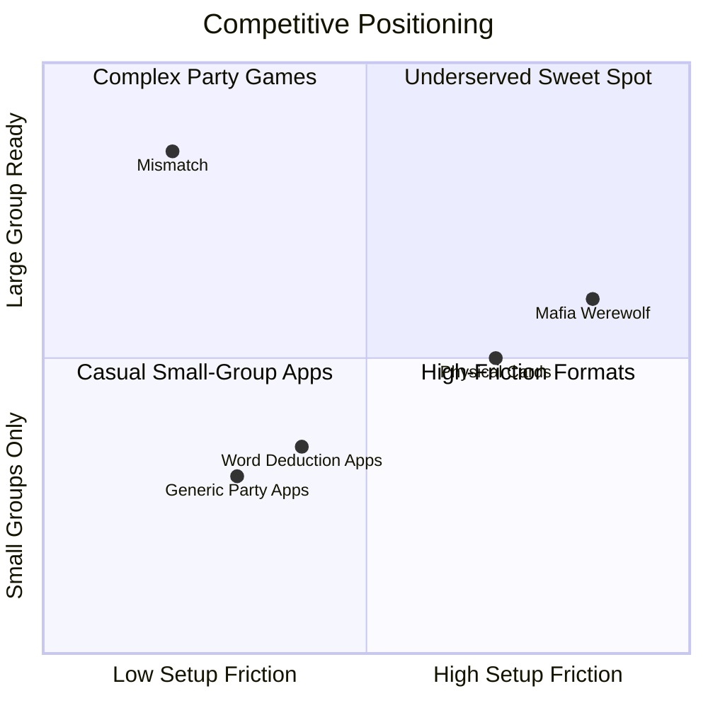

**Mismatch targets the upper-left quadrant:** low setup friction combined with large-group readiness — a space most competitors do not serve well.

### Differentiation Summary

| Dimension | Typical Competitor | Mismatch |
|-----------|-------------------|----------|
| Role distribution | Pass one phone | QR link to web card per player + pass-the-phone fallback |
| Forgotten word | Host re-reveals | Player reopens their web card URL in browser |
| Group size comfort | 4–8 | 6–16 (designed for) |
| Scoring | Win/lose per round | Session points + local named profiles |
| Player install | Often required | **No player app** — browser only for role cards |
| Host tooling | Same as player app | **Dedicated host app** for lobby, timer, vote, elimination |
| Content | Fixed or borrowed packs | Original word packs, extensible engine |

---

## 4. Existing Game Pain Points

Structured catalog of frustrations observed in the social deduction genre, mapped to Mismatch solutions.

### Setup & Distribution

| Pain Point | Description | Mismatch Solution |
|------------|-------------|-------------------|
| Host bottleneck | One person holds the phone; everyone queues | QR codes — parallel, private distribution |
| Privacy leaks | Neighbors glimpse cards during pass-the-phone | Individual devices; hold-to-reveal; optional PIN |
| Re-reveal requests | Players forget words before round starts | Personal web card URL — reopen in browser anytime |
| Slow add-player flow | Adding late arrivals requires full restart | Regenerate single QR from lobby |

### Gameplay

| Pain Point | Description | Mismatch Solution |
|------------|-------------|-------------------|
| Ghost role feels random | No-word player has no strategic anchor | Category Hint mode gives Ghost a category clue |
| Mismatch feels weak at scale | Minority role harder to hide in large groups | Role-specific scoring bonuses reward misdirection |
| Unclear win conditions | Players unsure who "won" the round | Explicit Reveal screen + Round Summary breakdown |
| Discussion drift | Conversations run too long | Configurable timer with haptic warnings |

### Scoring & Progression

| Pain Point | Description | Mismatch Solution |
|------------|-------------|-------------------|
| Shallow scoring | Round wins feel disconnected | Per-round points with role-specific bonuses |
| Device-bound stats | All stats live on host's phone | Local named profiles linked to player slots |
| No long-term progression | Same experience every session | Profile stats accumulate across sessions on device |
| Host accumulates everyone's data | One device owns all player history | Profiles belong to named players, not the device owner |

### Scale (8+ Players)

| Pain Point | Description | Mismatch Solution |
|------------|-------------|-------------------|
| Voting chaos | Hard to track who voted for whom | Tap-to-vote UI with avatar grid, confirmation step |
| Role balance breaks | Too many or too few special roles | Rules engine enforces distribution by player count |
| Reveal confusion | Group can't follow eliminations | Animated Reveal screen with clear role + word expose |
| Setup time grows linearly | More players = proportionally more friction | Bulk QR grid, quick-add player rows |

### Accessibility

| Pain Point | Description | Mismatch Solution |
|------------|-------------|-------------------|
| No phone / dead battery | Player excluded from QR flow | Pass-the-phone fallback mode |
| Camera unavailable | Can't scan QR | Share link via Messages; pass-the-phone fallback |

### Replayability

| Pain Point | Description | Mismatch Solution |
|------------|-------------|-------------------|
| Same words every time | Limited built-in content | Original word packs; IAP packs post-MVP |
| No reason to replay | Wins don't matter | Session leaderboard + profile stats |
| Ghost role repetitive | Same no-word experience | Classic vs Category Hint modes |

---

## 5. Evaluation of Proposed Differentiators

Each differentiator scored on **Impact**, **MVP Fit**, **Complexity**, and **Risk**.

### Differentiator 1: QR Link to Web Role Cards

| Dimension | Rating | Notes |
|-----------|--------|-------|
| Impact | **High** | Core value proposition; no player app install |
| MVP Fit | **High** | QR encodes HTTPS URL; role fetched from card API |
| Complexity | **Medium** | Minimal backend + responsive web page + host app integration |
| Risk | **Medium** | Link sharing, backend availability; mitigated by pass-the-phone fallback |

**Verdict: Include in MVP.** Hero feature. Each QR code is a unique URL (e.g. `https://play.mismatch.app/c/{token}`). Scanning opens the player's role card in their mobile browser. No player app required for players.

### Differentiator 2: Pass-The-Phone Fallback

| Dimension | Rating | Notes |
|-----------|--------|-------|
| Impact | **High** | Prevents excluding players without phones |
| MVP Fit | **High** | Sequential reveal UI on host device |
| Complexity | **Low** | Reuses role assignment logic |
| Risk | **Low** | Well-understood interaction pattern |

**Verdict: Include in MVP.** Host selects distribution mode in lobby.

### Differentiator 3: Better Ghost Experience

| Dimension | Rating | Notes |
|-----------|--------|-------|
| Impact | **Medium–High** | Improves replayability and role satisfaction |
| MVP Fit | **Partial** | Classic + Category Hint in MVP |
| Complexity | **Medium** | Alliance/custom modes add rule complexity |
| Risk | **Low** | Tunable via game settings |

**Verdict: Partial MVP.** Ship Classic Ghost and Category Hint modes. Defer Ghost + Mismatch alliance and custom role relationships to V1.1.

### Differentiator 4: Improved Scoring System

| Dimension | Rating | Notes |
|-----------|--------|-------|
| Impact | **Medium–High** | Drives replay; rewards skill |
| MVP Fit | **Partial** | Session scoring + role bonuses in MVP |
| Complexity | **Medium** | Scoring engine must be mode-aware |
| Risk | **Low** | Over-complex scoring confuses casual players |

**Verdict: Partial MVP.** Session leaderboard and role-specific bonuses in MVP. Win streaks and MVP score deferred to V1.1.

### Differentiator 5: Large Group Optimization

| Dimension | Rating | Notes |
|-----------|--------|-------|
| Impact | **High** | Primary market differentiator |
| MVP Fit | **High** | Design constraint on every screen |
| Complexity | **Medium** | UI/UX investment, not backend |
| Risk | **Low** | Requires playtesting at 10+ scale |

**Verdict: Include in MVP.** Not a bolt-on feature — a design principle applied to lobby, voting, reveal, and QR grid.

### Differentiator 6: Player-Centric Scoring

| Dimension | Rating | Notes |
|-----------|--------|-------|
| Impact | **Medium** | Meaningful for recurring groups |
| MVP Fit | **Partial** | Local named profiles in MVP |
| Complexity | **Medium** (local) / **High** (cloud) | Cross-device sync needs backend |
| Risk | **Medium** | Users may expect cloud sync; set expectations |

**Verdict: Partial MVP.** Local named profiles on each device (host assigns names in lobby; stats persist via SwiftData). Cross-device profiles and cloud sync deferred to V2.

### Recommended Simplifications

1. **Host iOS app (host may play)** — Host device runs lobby, timer, voting, elimination, and reveal. Other players never need the app; the host uses an in-app **My Card** when they are a player slot.
2. **QR = web link** — Each QR encodes a unique HTTPS URL to a personal role card page. No app deep links for players.
3. **Minimal card API** — Backend stores role assignments and serves web cards. Scope limited to card delivery — not full game sync.
4. **Rules engine with one shipped mode** — `GameMode` protocol from day one; only **Classic mode** polished for launch.
5. **Local host profiles, not player accounts** — Named profiles on host device for stats; players identified by URL token only.

---

## 6. Risks and Weaknesses

Honest assessment of what can go wrong and how to mitigate.

### Product Risks

| Risk | Severity | Mitigation |
|------|----------|------------|
| **QR scan friction** — camera permissions denied, bright rooms, older devices | Medium | Pass-the-phone fallback always available; clear permission prompt copy |
| **Host phone dependency** — host device dies mid-session | Medium | Session state persisted locally on host; recovery flow (future); verbal fallback always possible |
| **Genre confusion** — App Store compares to existing word games | Medium | Original branding, terminology, word packs; clear "not affiliated" messaging |
| **Backend outage** — web cards unavailable mid-setup | Medium | Pass-the-phone fallback; cache card on web after first load |
| **Link forwarding** — player shares their card URL | Medium | Short session TTL; optional PIN on web card; social contract |
| **Local profile limits** — stats don't follow players to new phones | Medium | Clear UX copy: "Stats saved on this device"; cloud sync as V2 upgrade path |

### Technical Risks

| Risk | Severity | Mitigation |
|------|----------|------------|
| **Rules-engine over-engineering** — flexible architecture delays MVP | High | Strict `GameMode` plugin interface; ship one mode; resist adding modes pre-launch |
| **QR payload size limits** — dense QR hard to scan | Low | Minimal payload (role + word + IDs); test at max QR error correction |
| **SwiftData migration pain** — schema changes break profiles | Medium | Version models early; migration tests in CI |
| **Keychain access edge cases** | Low | N/A for players — web URLs persist in browser history/bookmarks |

### Content Risks

| Risk | Severity | Mitigation |
|------|----------|------------|
| **Word pack volume** — original content requires authoring effort | Medium | Ship 50–100 pairs in MVP; quality over quantity |
| **Word pair ambiguity** — pairs too similar or too obvious | Medium | Internal playtesting rubric; flag pairs that confuse testers |
| **Legal/trademark** — marketing language too close to competitors | Low | Never use competitor names in App Store copy |

### Business Risks

| Risk | Severity | Mitigation |
|------|----------|------------|
| **Low retention** — party games are episodic | Medium | Profile stats and word pack IAP give return reasons |
| **Monetization too early** — IAP before product-market fit | Medium | Free launch; validate with TestFlight first |
| **Solo dev timeline** — 8–12 week estimate is aggressive | Medium | Strict MVP scope; postpone list is non-negotiable |

---

## 7. Alternative Solutions

For each major design bet, a rejected alternative and rationale.

### Role Distribution

| Approach | Pros | Cons | Decision |
|----------|------|------|----------|
| **Chosen: QR link to web role card** | No player app install; works on any phone browser; easy QR (just a URL) | Requires minimal backend + web page | **MVP** |
| Self-contained encrypted QR in player app | Fully offline | Requires every player to install the app | Rejected |
| Multipeer Connectivity live sync | Real-time state on all devices | Fragile at 12+ peers; complex; battery drain | Defer to V2 evaluation |
| SMS / web deep-link to web card | Works without QR camera | SMS API cost for automated send; share-via-Messages OK for V1.5 | Partial — share sheet V1.5 |
| NFC tap | Fast, no camera | Low adoption for this use case | Rejected |
| Printed QR cards | No setup on player side | Requires printer; not reusable | Rejected |

### Scoring & Profiles

| Approach | Pros | Cons | Decision |
|----------|------|------|----------|
| **Chosen: Local named profiles (SwiftData)** | No accounts; player-centric; persists across sessions | Stats device-bound | **MVP** |
| Game Center | Apple-native leaderboard | Account friction; not player-centric across friend groups | Rejected |
| Device-only session score | Simplest | Host accumulates all stats; no long-term progression | Rejected |
| Cloud accounts | Cross-device sync | Backend cost; signup friction; against V1 constraints | Defer to V2 |

### Ghost Role Design

| Approach | Pros | Cons | Decision |
|----------|------|------|----------|
| **Chosen: Classic + Category Hint modes** | Gives Ghost strategic anchor; tunable | Two modes to test | **MVP** |
| Remove Ghost role entirely | Simpler rules | Reduces genre appeal and replayability | Rejected |
| Ghost + Mismatch alliance | High strategy | Complex rules explanation; hard at 12+ players | Defer to V1.1 |
| Ghost gets a random decoy word | Easier to bluff | Changes core tension of the role | Rejected |

### Voting

| Approach | Pros | Cons | Decision |
|----------|------|------|----------|
| **Chosen: Host-device tap-to-vote** | Simple; no network; large touch targets | Host must collect votes (or players tell host) | **MVP** |
| Simultaneous multi-device voting | Everyone votes privately on own phone | Requires network sync; complex | Defer to V2 |
| Verbal vote only | Zero UI needed | Chaos at 10+; no audit trail for scoring | Rejected as sole method |
| Paper ballots | No tech needed | Defeats purpose of app | Rejected |

### Game Architecture

| Approach | Pros | Cons | Decision |
|----------|------|------|----------|
| **Chosen: Flexible rules engine, one shipped mode** | Extensible; future modes cheap to add | Slight upfront architecture cost | **MVP** |
| Hard-coded single mode | Fastest to build | Expensive to add modes later | Rejected given user preference |
| Multiple modes at launch | Broader appeal | Delays launch; splits testing | Rejected |

---

## 8. Recommended MVP

### MVP Goal

Play a complete 6–16 player session with web-linked QR role cards, pass-the-phone fallback, host-app-driven elimination, one polished game mode, session scoring, and local named player profiles — in under three minutes of setup.

### Who Needs What

| Role | Needs Mismatch iOS app? | Needs browser? |
|------|-------------------------|----------------|
| **Host** | **Yes** — lobby, QR grid, timer, vote, elimination, reveal | No |
| **Player** | **No** — scan QR or receive link | **Yes** — personal web role card |

### Architecture Overview

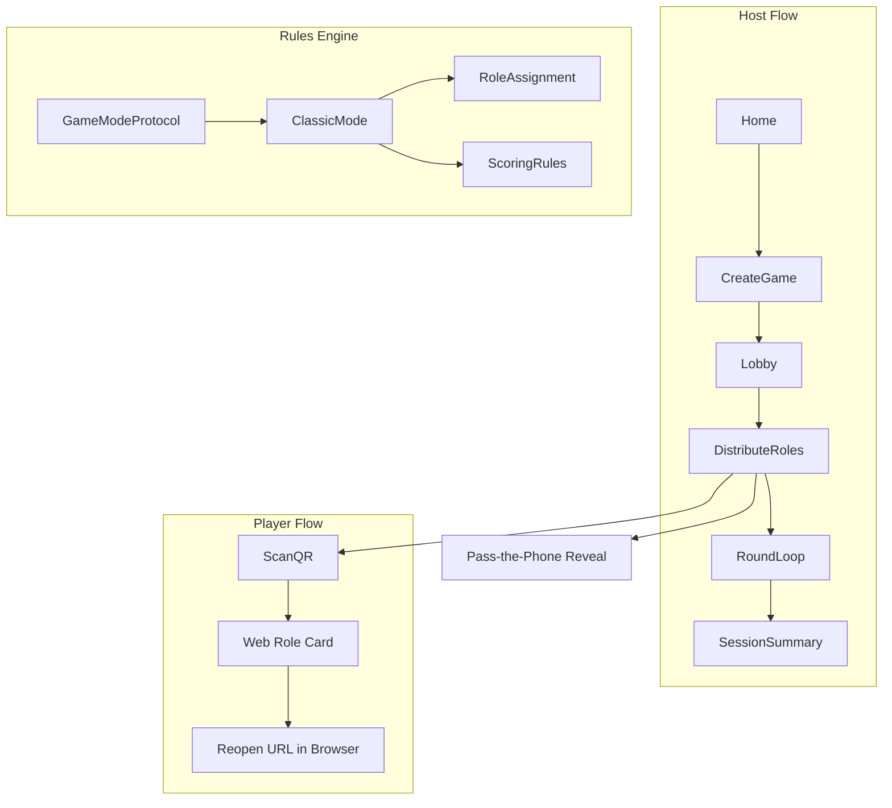

### Classic Mode (V1 Shipped Mode)

**Roles:**

| Role | Count (typical) | Secret | Goal |
|------|----------------|--------|------|
| Insider | Majority | The common word | Identify and eliminate a Mismatch or Ghost |
| Mismatch | 1–2 (scales with count) | A similar but wrong word | Avoid elimination; blend in |
| Ghost | 0–2 when **Ghost** on | No word (or category hint) | Avoid elimination; guess the common word to win |

**Phases:**

1. **Setup** — Host creates game, adds players, configures settings
2. **Role distribution** — Random shuffle of roles + words; each player **picks a face-down card** to reveal (web or pass-the-phone); host **My Card** uses same pick UI in-app
3. **Discussion** — Host runs timed discussion from app (configurable, default 3 minutes)
4. **Nomination & vote** — Host records group vote in app
5. **Elimination & reveal** — Host eliminates player and reveals role + word in app (shown to group)
6. **Score** — Points applied per scoring rules
7. **Continue or end** — Next round or Session Summary

**Win conditions (per round):**

- **Insider side wins** if a Mismatch or Ghost is eliminated
- **Mismatch wins** if they survive the vote
- **Ghost wins** (bonus) if they guess the common word correctly before or during reveal

**Word packs (MVP):**

- 1 built-in general pack: ~50–100 original word pairs (e.g., "Airport / Train Station", "Piano / Guitar")
- Category labels used for Ghost Category Hint mode (derived from pair metadata)

### Random Role Assignment

Roles and words are **never chosen by the host or players manually**.

1. Rules engine picks one **word pair** for the round (from active word pack).
2. Engine builds the role pool for player count (Insiders / Mismatches / Ghosts per distribution table).
3. Pool is **shuffled** with a cryptographically fair random permutation and mapped one-to-one to player slots (including **You** when host is playing).
4. Assignments are fixed at **Distribute Roles** — the card pick is how a player **claims** their pre-randomized secret, not a host override.

> **Fairness:** No player sees another slot's assignment until elimination reveal. Re-pick is not allowed once a card is flipped.

### Card Pick Reveal (Web + Pass-the-Phone)

Inspired by the familiar party-game moment of **choosing a face-down card** (similar in *feel* to Undercover's pick-a-card reveal — not a clone of its rules or content). Same interaction on **web role cards** and **pass-the-phone** on the host app.

**Pick screen (before reveal):**

- Grid of **4–6 identical face-down cards** (count is cosmetic; any tap reveals *this player's* assignment)
- Copy: *"Pick a card to see your role"* (or *"...your word"* when **Show role on card** is off)
- No role names or words visible on backs

**After tap:**

- Flip animation → **if `showRoleOnCard`:** role badge (**Insider** / **Mismatch** / **Ghost**) + secret below
- **If `showRoleOnCard` off:** no badge — *"Your word"* or *"No word — use the hint"* (Ghost) only
- **Insider / Mismatch:** word under **hold-to-reveal** (press and hold to peek; release to hide)
- **Ghost:** no word; optional category hint after flip
- **Done** / auto-advance — web: bookmarkable revealed state; pass-the-phone: **Hide & pass** → next player

**Reopen / forgot word:**

- Same URL or **My Card** opens **revealed** card (skip pick screen); hold-to-reveal still works for word

**Host-player (QR mode):**

- **View My Card** opens the same pick → flip → hold-to-reveal flow natively in the host app (shared component with pass-the-phone)

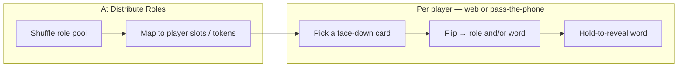

### QR & Web Role Card Mechanism

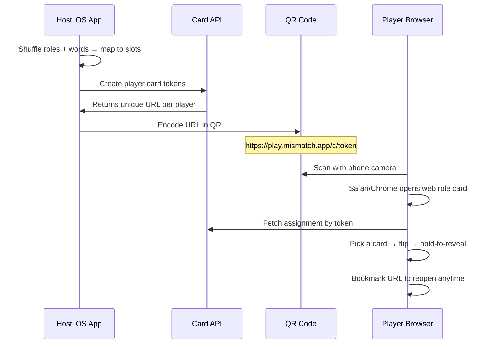

**QR contents:** A standard HTTPS URL — nothing else. The QR is literally a link to the webpage.

**Example URL:** `https://play.mismatch.app/c/7f3a9c2e1b4d...`

**Web role card page (player-facing):**
- Responsive mobile web page — no app, no account
- Respects session **`showRoleOnCard`** from API
- **Card pick grid** → flip → optional role badge + hold-to-reveal word
- Optional category hint for Ghost after flip
- Reopened URL skips pick; shows revealed card + hold-to-reveal
- Optional 4-digit PIN (V1.5)

**Card API (minimal backend):**
- Host app creates session and player slots via API
- API returns opaque token + full card URL per player
- Web page fetches assignment by token; respects `showRoleOnCard` (role omitted in JSON when off)
- Records `pickedAt` on first card flip (idempotent)
- Assignment payload available only after distribute; pick state persisted server-side
- Tokens expire when session ends (or after 24h)
- No player accounts; token **is** the player's identity for that session

**Share via Messages (V1.5):** Host taps Share next to a player → iOS share sheet → Messages with their card URL. No SMS API required.

**Security (proportionate to threat model):**
- Opaque unguessable tokens (128-bit random)
- HTTPS only; no role data in URL path beyond token
- Short TTL per session
- Optional PIN on web card
- `noindex` on card pages

### Pass-The-Phone Fallback

- Host selects "Pass the Phone" in lobby distribution settings
- **Same random assignment engine** as QR mode (shuffle at Distribute Roles) — fully offline on host device
- Sequential UI: *"Pass to [Name]"* → **card pick grid** → flip → hold-to-reveal → **Hide & pass** → next player
- Shared SwiftUI **CardPickView** component matches web interaction (pick → flip → hold)
- Host device only — no web page needed for this path
- If **I'm playing** is on, host is included in the pass order (recommended: **host picks last** so they keep the phone to run the game)

### Host-as-Player (V1)

The person running the app is **not** locked out of the game. Most friend groups expect the host at the table.

**Lobby**

- **I'm playing** toggle (default **on**)
- When on, a **You** player slot is pinned at the top of the lobby (crown badge); counts toward player total and role distribution
- Host can turn off to pure-mod mode (dedicated facilitator at large events)

**How the host gets their secret**

| Distribution mode | Host-player experience |
|-------------------|------------------------|
| **QR → web** | Host does **not** scan their own QR on the host phone. QR grid row for **You** shows **View My Card** → same **pick → flip → hold-to-reveal** sheet in the host app. API still issues a `cardUrl` for that slot (stats, parity, share link if needed). |
| **Pass-the-phone** | Host is one slot in the pass order; same **card pick** UI as every other player |

**During the round**

- **My Card** button (lock icon) on Discussion, Voting, and Round Summary — host reopens their secret without leaving the flow
- Host joins table talk like any player; the app records **group consensus** for elimination (unchanged — not a secret ballot app)
- Host can be voted out; they **keep moderating** from the same device after elimination
- Reveal screen is shown to the group on the host phone whether or not the host was eliminated

**Rules unchanged**

- Host-player is a normal **PlayerSlot** with `isHost: true` — same roles, words, scoring, and win conditions
- Role counts include the host when **I'm playing** is on (e.g. 8 humans at the table = 8 slots, not 7 + facilitator)

**UX guardrails**

- Voting grid: host slot labeled **You**; no special immunity
- Optional post-confirm copy when host eliminates themselves: *"You're out — keep running the app for the group"*
- Ghost word-guess prompt works when the eliminated player is the host

### Scoring (MVP)

| Event | Points | Who |
|-------|--------|-----|
| Survived the round | +1 | All non-eliminated players |
| Correct vote (voted for Mismatch/Ghost) | +2 | Insider players who voted correctly |
| Mismatch survived | +3 | Mismatch player |
| Mismatch misdirection bonus (≤1 vote received) | +1 | Mismatch player |
| Ghost survived | +2 | Ghost player |
| Ghost correct word guess | +5 | Ghost player |

Session leaderboard displayed at end. Points written to linked local named profiles.

### Large-Group UX (MVP)

- Quick-add players: name + auto-assigned avatar color
- Bulk QR grid: scrollable grid of all player QRs; tap to enlarge; share sheet per QR
- Vote UI: avatar grid with large touch targets; select → confirm → submit
- Reveal: full-screen animated reveal with role badge + word
- Discussion timer: configurable (1–5 min); haptic pulse at 30s and 10s remaining

### Player Count Support

| Players | Insider | Mismatch | Ghost |
|---------|---------|----------|-------|
| 4–5 | rest | 1 | 0 |
| 6–7 | rest | 1 | 1 |
| 8–9 | rest | 1 | 1 |
| 10–11 | rest | 2 | 1 |
| 12–13 | rest | 2 | 1 |
| 14–16 | rest | 2 | 2 |

**Ghost count is never chosen manually** — when **Ghost** is enabled, the engine reads player count and applies the Ghost column above. When **Ghost** is off (default), Ghost count is **0** and those slots become **Insiders**.

### Lobby rule toggles (inline settings)

All rules live in the **Lobby** — no separate settings screen for V1. Toggles sync to the Card API so web cards match the host session.

| Toggle | Field | Default | Effect |
|--------|-------|---------|--------|
| **Ghost** | `ghostEnabled` | **Off** | When **on**, Ghost slots follow the table above by player count. When **off**, no Ghosts — Mismatch + Insider only |
| **Show role on card** | `showRoleOnCard` | **Off** | When **on**, flip shows **Insider / Mismatch / Ghost** badge + word/hint. When **off**, word/hint only — players infer team from discussion |
| **I'm playing** | `hostIsPlaying` | **On** | Host occupies a **You** player slot |
| **Discussion timer** | `timerSeconds` | 3 min | Timed discussion phase |
| **Distribution** | `distributionMode` | QR | QR → web vs pass-the-phone |

**Ghost — detail**

- Default **off** for simpler first rounds (Insider vs Mismatch only).
- Host turns **Ghost** on for fuller Classic mode; **how many** Ghosts is automatic (e.g. 8 players + Ghost on → 1 Ghost, 1 Mismatch, rest Insiders).
- Ghost mode sub-option (Classic vs Category Hint) applies when Ghost is on — defer Category Hint to V1.5 if needed.

**Show role on card — detail**

- Default **off** (word-only cards — closer to Undercover feel).
- When **on:** flip shows role badge + hold-to-reveal word.
- When **off:** flip shows *"Your word"* + hold-to-reveal only (Ghost: hint / no-word copy).
- Role stays on server / host for elimination **Reveal** and scoring; hidden from player card UI when off.
- API **omits** `role` in `GET /cards/{token}` when `showRoleOnCard` is false.

### Secret isolation (one player, one secret)

**If you are not the host, you must never see another player's word or role before elimination reveal.**

| Surface | What a non-host player sees |
|---------|------------------------------|
| **Web role card** | **Only their own** token's word/hint — via pick → flip on their URL |
| **Other players' QRs / links** | Nothing (they don't get host QR grid) |
| **Another player's token URL** | API returns **403/404** — tokens are not interchangeable |
| **Discussion / vote** | Names and avatars only — no secrets |

| Surface | Host device |
|---------|-------------|
| **Lobby / QR grid** | Player **names + QR/link only** — **no words, no roles** |
| **My Card** (if playing) | **Host's own** secret only |
| **Pass-the-phone** | Current holder sees **only their** card; **Hide & pass** before handing off |
| **Discussion / voting** | Timer and names — **no roster of words** |
| **Elimination reveal** | Role + word shown **to the whole group** on host phone — intentional public moment |

**Implementation rules**

- `GET /cards/{token}` returns **one** assignment bound to that token — never a session-wide list.
- No player-facing `GET /sessions/{id}/players` or bulk card export.
- Host app stores all assignments in memory for **Reveal** and scoring, but **UI must not preview** other slots' words in lobby, QR grid, or mid-round screens.
- QR encodes URL only; grid cells show name + QR — not role/word preview.
- Pass-the-phone: word hidden on flip release; explicit **Hide & pass** before next player.
- Optional web card PIN (V1.5) reduces link-forwarding leaks.

---

## 9. Features to Postpone

| Feature | Target Version | Rationale |
|---------|---------------|-----------|
| Cloud sync / user accounts | V2 | Player cards use tokens; full accounts deferred |
| Cross-device player profiles | V2 | Depends on accounts or export/import |
| Ghost + Mismatch alliance mode | V1.1 | Adds rule complexity; needs playtesting |
| Custom role relationships editor | V1.1 | Power-user feature; not needed for first sessions |
| Additional game modes (location-based, faction-based) | V1.2+ | Rules engine supports; content/rules need design |
| Word pack IAP | V1.2+ | Validate core loop first |
| User-generated word packs | V2+ | Moderation and quality concerns |
| Simultaneous multi-device voting | V2 | Requires network layer |
| Host handoff / co-host | V2 | Edge case; adds state sync |
| Multipeer Connectivity live sync | V2 | Evaluate need after QR MVP ships |
| Win streaks beyond local profile | V1.1 | Nice-to-have; profile stats sufficient for MVP |
| MVP score / advanced analytics | V1.1 | Needs baseline data first |
| Localization | V1.1 | English-first; strings externalized from day one |
| iPad-optimized layout | V1.1 | iPhone-first; iPad scales acceptably |
| Apple Watch companion | Explore later | No clear MVP value |
| Android version | V2+ | iOS-only constraint for V1 |
| Session replay / history viewer | V1.1 | Profile stats sufficient for MVP |
| Custom word pair creation (local) | V1.1 | Host Pro candidate |
| Export session stats (CSV/PDF) | V1.1 | Host Pro candidate |

---

## 10. Screen Inventory

### P0 — Host iOS App

| Screen | Purpose | Key Elements |
|--------|---------|--------------|
| **Home** | Host entry point | Host Game, Resume Session (if active), How to Play |
| **Create Game** | Configure new session | Player count stepper, mode selector, settings shortcut |
| **Game Settings** | Session rules | Timer, Ghost enabled, Ghost mode, **Show role on card**, word pack picker |
| **Lobby** | Pre-game player management | Player list, **I'm playing** toggle, **inline rule toggles** (Ghost, show role, timer), add/remove, avatar colors, distribution mode, Start Game |
| **QR Grid** | Bulk QR display | Name + QR/link per player only — **no role or word preview**; **You** row → View My Card |
| **My Card (host-player)** | Host's secret when playing | Card pick → flip → hold-to-reveal; lock icon from Discussion/Voting |
| **Pass-the-Phone Reveal** | Fallback distribution | Pass to [Name] → card pick → flip → hold-to-reveal → Hide & pass; host in order if playing |
| **Discussion** | Timed discussion phase | Countdown timer, round number, player count remaining, **My Card** (if host playing), End Early button |
| **Voting** | Elimination vote (host app) | Avatar grid, selected highlight, confirm dialog — host records group vote |
| **Reveal** | Elimination reveal (host app) | Player name, role badge, word expose; shown to group; Ghost guess prompt |
| **Round Summary** | Per-round scoring | Points earned per player, running totals, Continue / End Session |
| **Session Summary** | End-of-session results | Final leaderboard, role win breakdown, profile stat updates |

### P0 — Web Role Card (Player-Facing)

| Screen | Purpose | Key Elements |
|--------|---------|--------------|
| **Web Role Card** | Player's secret in browser | Card pick → flip; role badge if enabled; hold-to-reveal word; Ghost hint; bookmarkable URL |

> **Removed from player-facing flow:** QR Scanner, Join Game, standalone player app — guests use the web page. **Exception:** host-player **My Card** is native in the host app only (same device as moderator).

### P1 — Important but Launchable Without

| Screen | Purpose | Key Elements |
|--------|---------|--------------|
| **Profiles List** | Local named players | Name, avatar, games played, win rate |
| **Profile Detail** | Individual stats | Wins by role, streak, session history list |
| **Settings** | App preferences | Default PIN, haptics toggle, timer default, about/version |
| **How to Play** | Onboarding tutorial | Original rules explanation, role descriptions, tips for large groups |

### Internal / Dev Only

| Screen | Purpose |
|--------|---------|
| **Rules Engine Admin** | Preview mode configs, test role distributions, validate word packs |

### Navigation Structure

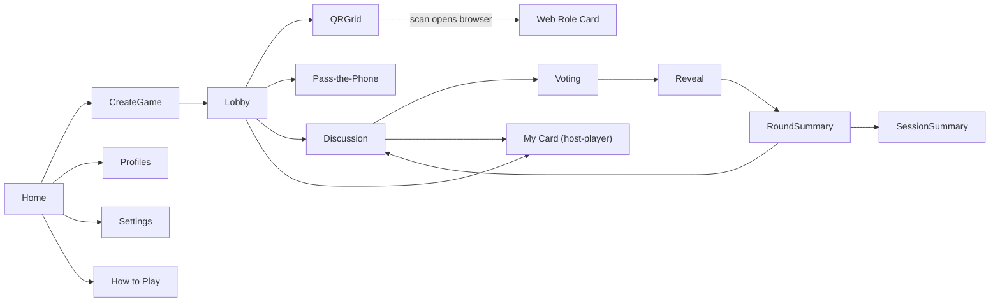

---

## 11. User Flows

### Flow A — Host Creates Game (QR → Web)

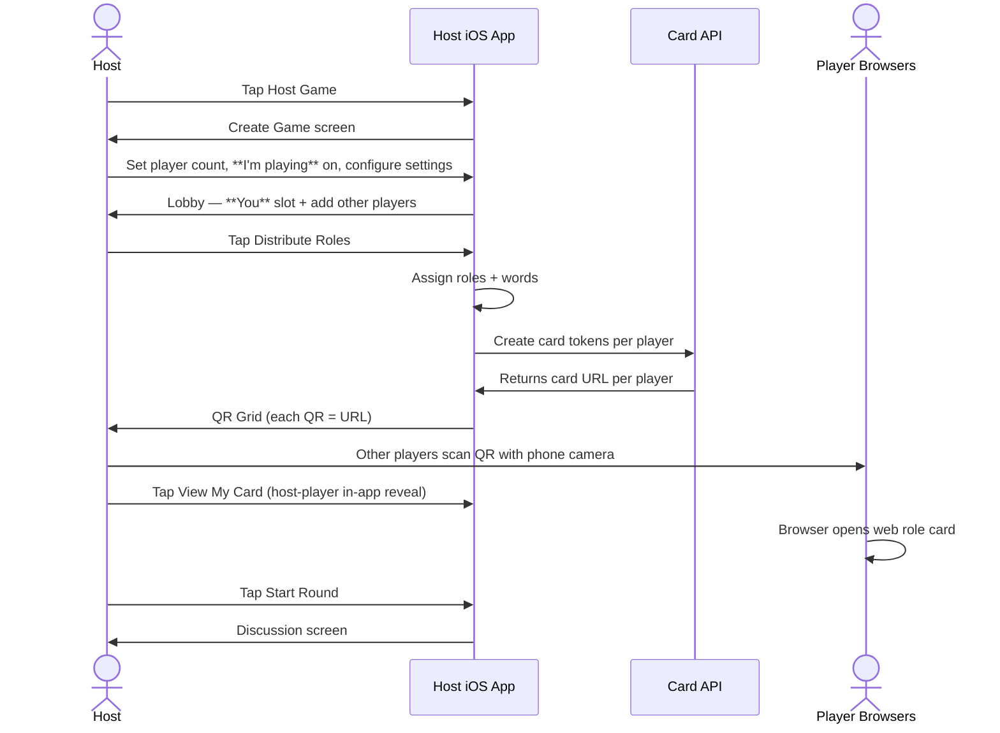

### Flow B — Player Gets Role via Web (No App)

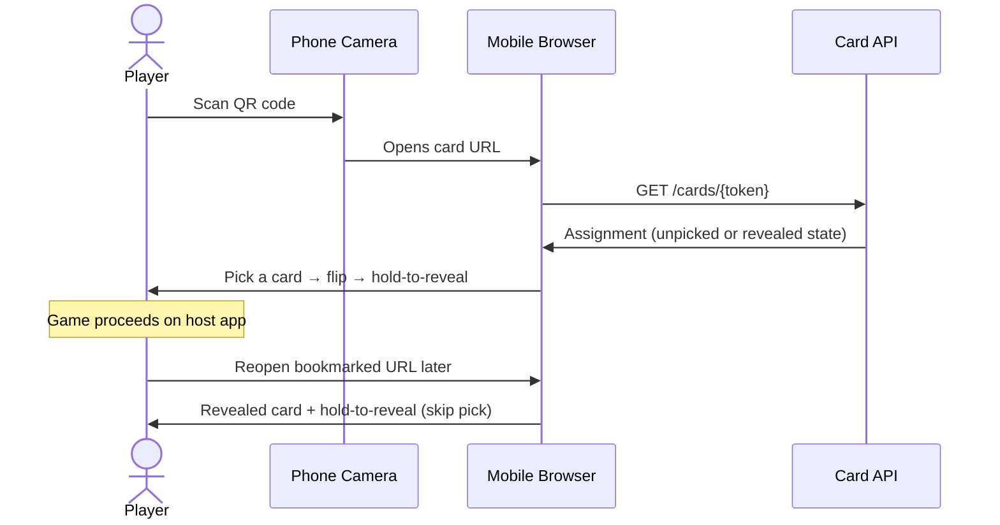

### Flow C — Pass-The-Phone Fallback

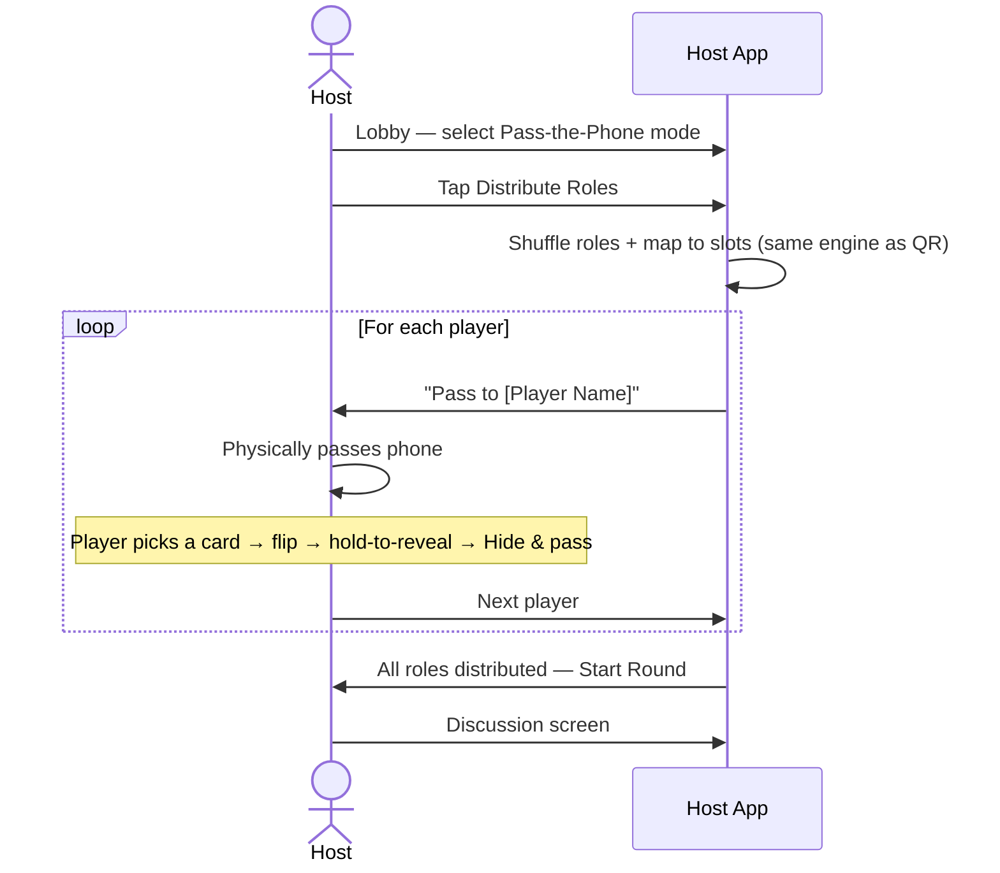

### Flow E — Host Plays (QR Mode)

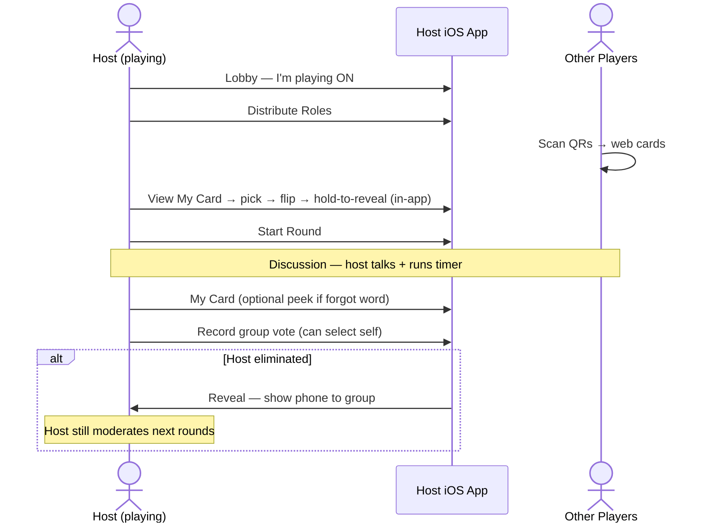

### Flow D — Round Loop

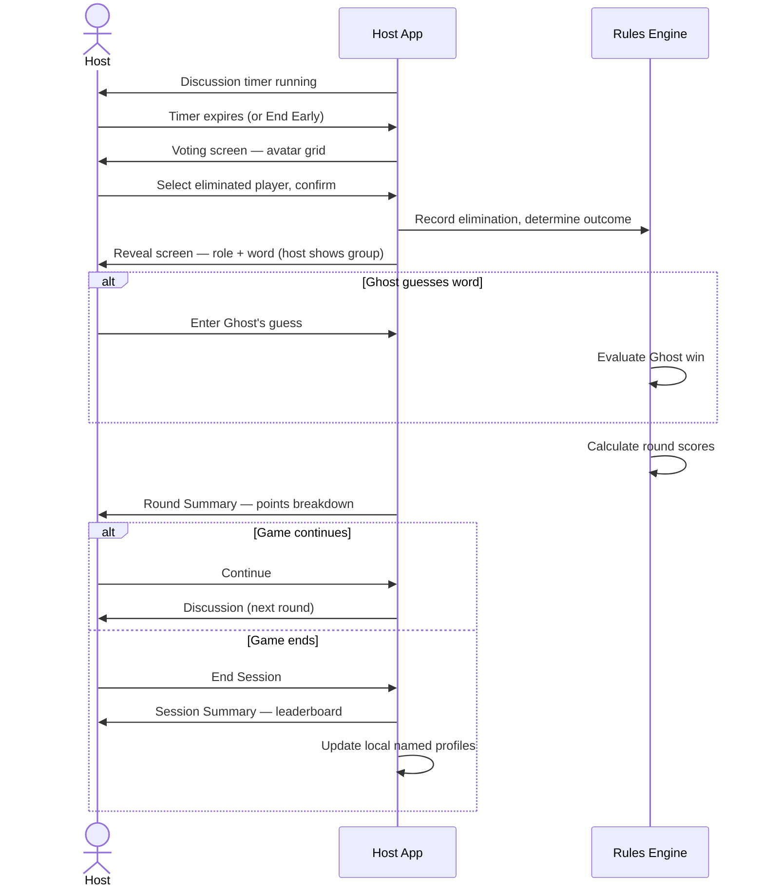

### Edge Cases

| Scenario | Behavior |
|----------|----------|
| **Player joins late** | Host adds player in lobby → regenerate QR for new slot only → existing tokens unaffected |
| **Player forgot word** | Player reopens bookmarked web card URL — no host action needed |
| **Host ends session early** | Confirm dialog → invalidate card tokens via API → Session Summary shown |
| **Tie vote** | Revote prompt (exclude tied players from revote, or host breaks tie — configurable in settings, default: revote) |
| **QR scan opens wrong browser / slow load** | URL can be copied from QR grid; share link via Messages |
| **Backend unavailable** | Pass-the-phone fallback on host app; show error on web card with retry |
| **Host app backgrounded mid-round** | Session state persisted locally on host; resume on foreground |
| **Player closes browser tab** | Same URL in history or bookmark restores card |
| **Host is playing + QR mode** | **You** row uses in-app My Card; other rows use QR URLs |
| **Host voted out** | Mark slot eliminated; host continues running timer, vote, reveal on same device |
| **I'm playing off** | No My Card UI; host is pure facilitator; role count = other players only |
| **Show role on card off** | Player cards show word/hint only; role at elimination reveal only |
| **Ghost off** | Zero Ghosts; Mismatch + Insider only regardless of player count |
| **Ghost on** | Ghost count from player-count table (not manual) |
| **Wrong / stolen card URL** | API returns 403/404 — no other player's data |
| **Host opens guest's link** | Same as any player — only that one card (host uses QR grid + My Card, not guest URLs for roster) |
| **Toggle changed after Distribute** | Disabled until next **Distribute Roles**; banner in lobby |
| **Minimum players not met** | Start Game disabled until ≥ 4 players added |

---

## 12. Data Models

Conceptual models for the domain layer. No Swift implementation — structure only.

### Core Session Models

**GameSession**
- `id: UUID`
- `createdAt: Date`
- `settings: GameSettings`
- `state: GameState` (enum: setup, distributing, discussing, voting, revealing, roundSummary, sessionSummary, ended)
- `players: [PlayerSlot]`
- `rounds: [Round]`
- `distributionMode: DistributionMode` (enum: qr, passThePhone)
- `currentRoundIndex: Int`

**PlayerSlot**
- `id: UUID`
- `displayName: String`
- `avatarColor: AvatarColor` (enum or hex)
- `isHost: Bool` (true for the **You** slot when host is playing)
- `cardUrl: String` (HTTPS URL encoded in QR)
- `cardToken: String` (opaque token for API)
- `profileId: UUID?` (link to local PlayerProfile)
- `isEliminated: Bool`
- `hasOpenedCard: Bool` (true after card pick + flip; synced from API on web)
- `pickedAt: Date?` (first card flip)

**RoleAssignment**
- `role: Role` (enum: insider, mismatch, ghost)
- `word: String?` (nil for Ghost in classic mode)
- `categoryHint: String?` (for Ghost in category hint mode)

**GameSettings**
- `playerCount: Int`
- `hostIsPlaying: Bool` (default **true**)
- `ghostEnabled: Bool` (default **false** — Ghost count from table when true)
- `showRoleOnCard: Bool` (default **false**)
- `ghostMode: GhostMode` (enum: classic, categoryHint)
- `timerSeconds: Int` (default 180)
- `wordPackId: String`
- `gameModeId: String` (default: "classic")

### Round Models

**Round**
- `index: Int`
- `eliminatedPlayerId: UUID?`
- `votes: [Vote]`
- `outcome: RoundOutcome` (enum: insiderSideWins, mismatchWins, ghostWins)
- `scoreEvents: [ScoreEvent]`
- `ghostGuess: String?`

**Vote**
- `voterId: UUID` (or anonymous aggregate for MVP host-entry)
- `targetId: UUID`

**ScoreEvent**
- `playerId: UUID`
- `points: Int`
- `reason: ScoreReason` (enum: survived, correctVote, mismatchSurvived, misdirectionBonus, ghostSurvived, ghostGuess, etc.)

### Profile Models

**PlayerProfile** (persisted via SwiftData)
- `id: UUID`
- `name: String`
- `avatarColor: AvatarColor`
- `createdAt: Date`
- `stats: PlayerStats`

**PlayerStats**
- `gamesPlayed: Int`
- `winsAsInsider: Int`
- `winsAsMismatch: Int`
- `winsAsGhost: Int`
- `totalPoints: Int`
- `winRate: Double` (computed)
- `currentStreak: Int`
- `bestStreak: Int`

### Content Models

**WordPack**
- `id: String`
- `displayName: String`
- `pairs: [WordPair]`
- `isBuiltIn: Bool`

**WordPair**
- `id: String`
- `insiderWord: String` → shown to **Insider** players (alias `commonWord` in API)
- `mismatchWord: String` → shown to **Mismatch** player(s)
- `category: String` (used for Ghost hints)

### Rules Engine Models

**GameMode** (protocol)
- `id: String`
- `displayName: String`
- `minPlayers: Int`
- `maxPlayers: Int`
- `roleDistributionRules: RoleDistributionRules`
- `scoringRules: ScoringRules`
- `phaseSequence: [GamePhase]`
- `winConditions: WinConditions`

**RoleDistributionRules**
- `computeRoles(playerCount: Int, settings: GameSettings) -> [RoleAssignment]` — Ghost slots from table iff `ghostEnabled`

**ScoringRules**
- `computeRoundScores(round: Round, assignments: [RoleAssignment]) -> [ScoreEvent]`

### Card API Models (Backend)

**CardToken**
- `token: String` (opaque, unguessable)
- `sessionId: UUID`
- `playerSlotId: UUID`
- `role: Role`
- `word: String?`
- `categoryHint: String?`
- `expiresAt: Date`
- `createdAt: Date`

**SessionRecord** (server)
- `id: UUID`
- `hostDeviceId: String?` (optional, for session management)
- `ghostEnabled: Bool`
- `showRoleOnCard: Bool`
- `ghostMode: String?`
- `state: String`
- `createdAt: Date`
- `expiresAt: Date`

### Entity Relationships

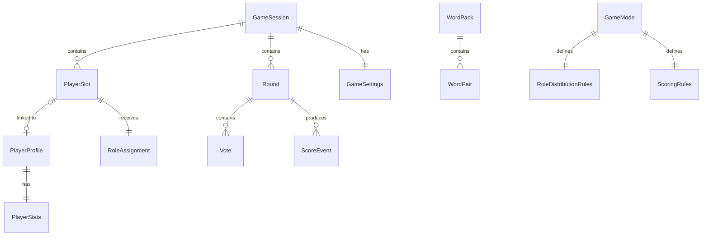

### Persistence Strategy

| Data | Storage | Lifetime |
|------|---------|----------|
| Active game session | In-memory on host + optional local snapshot | Duration of session |
| Card tokens + role data | Card API (server/database) | Until session ends or TTL expires |
| Player profiles + stats | SwiftData on host device | Permanent (device-local) |
| Completed session history | SwiftData on host device | Permanent (optional; last 20 sessions) |
| Word packs | Bundled in host app JSON + future IAP | Permanent |

---

## 13. Technical Architecture

### Layer Diagram

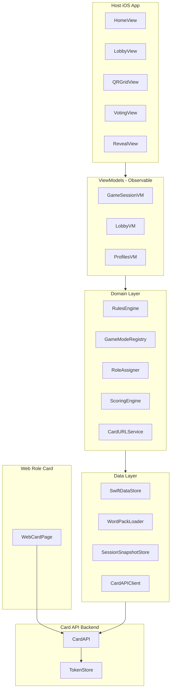

### MVVM Conventions

- **Views:** SwiftUI only; no business logic; observe ViewModels via `@Observable`
- **ViewModels:** One per major screen/feature; coordinate domain services; expose UI state
- **Domain:** Pure Swift; no SwiftUI imports; fully unit-testable
- **Data:** Repository pattern over SwiftData and Card API client

### Project Folder Structure

```
mismatch/
  App/
    mismatchApp.swift
    AppRouter.swift
  Features/
    Home/
      HomeView.swift
      HomeViewModel.swift
    CreateGame/
    Lobby/
    QR/
      QRGridView.swift
    WebCard/
      (hosted separately — play.mismatch.app)
    PassThePhone/
    GameRound/
      DiscussionView.swift
      VotingView.swift
      RevealView.swift
      RoundSummaryView.swift
    SessionSummary/
    Profiles/
    Settings/
    HowToPlay/
  Domain/
    Models/
    RulesEngine/
      RulesEngine.swift
      GameModeRegistry.swift
    Modes/
      ClassicMode.swift
    Scoring/
      ScoringEngine.swift
    QR/
      QRGenerator.swift
      CardURLService.swift
    API/
      CardAPIClient.swift
    RoleAssignment/
      RoleAssigner.swift
  Data/
    Persistence/
      SwiftDataContainer.swift
      Models/
    Repositories/
      ProfileRepository.swift
      SessionRepository.swift
    Keychain/
      (host-only secrets if needed)
  Resources/
    WordPacks/
      general.json
  DesignSystem/
    Colors.swift
    Typography.swift
    Components/
      AvatarView.swift
      TimerView.swift
      PlayerGridView.swift
```

### Key Technical Decisions

| Decision | Choice | Rationale |
|----------|--------|-----------|
| Minimum iOS | iOS 17+ | SwiftData, `@Observable`, modern SwiftUI |
| Architecture | MVVM | User constraint; clean separation for rules engine testing |
| Persistence | SwiftData | Host profiles, session history; native, no dependencies |
| Card delivery | Minimal Card API + web page | Role cards for players; host app calls API to create tokens |
| QR generation | CoreImage (`CIFilter.qrCodeGenerator`) | Encodes HTTPS URL only — no third-party deps |
| QR scanning | **Not in host app** — players use native phone camera | Opens URL in browser automatically |
| Web role card | Responsive web app (e.g. Next.js, Astro, or static HTML) | Hosted at `play.mismatch.app` |
| Card API | Serverless or lightweight backend (Supabase, Vapor, Cloudflare Workers) | Create tokens, serve card data |
| Networking | Host app ↔ Card API only | Players hit web + API; no full game sync |
| Dependencies | Zero third-party in iOS app | Web stack TBD; keep minimal |

### Rules Engine Design

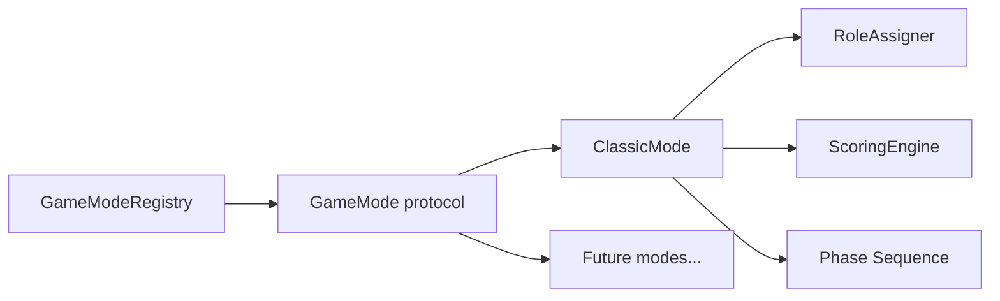

**GameMode protocol responsibilities:**
- Declare min/max players
- Compute role distribution for a given player count and settings
- Define phase sequence (ordered list of game phases)
- Define scoring rules (delegate to ScoringEngine with mode-specific config)
- Define win conditions

**Adding a new mode (post-MVP):**
1. Create struct conforming to `GameMode`
2. Register in `GameModeRegistry`
3. Add mode selector entry in Create Game screen
4. No changes to Views beyond mode picker

### Card URL & QR Design

QR codes encode **HTTPS URLs only** — no encrypted payloads, no app deep links.

**Create cards (host app → API):**
1. Host assigns roles + words locally
2. For each player: `POST /sessions/{id}/cards` with `{ playerSlotId, role, word, categoryHint? }` and session flags `{ showRoleOnCard, ghostEnabled, ... }`
3. API generates opaque token, stores card record, returns `{ token, cardUrl }`
4. Host renders QR from `cardUrl` via CoreImage (QR = the URL string)

**Player opens card (browser → API):**
1. Player scans QR → phone camera opens `https://play.mismatch.app/c/{token}`
2. Web page calls `GET /cards/{token}`
3. API returns `{ showRoleOnCard, role?, word?, categoryHint?, pickedAt? }` — **`role` omitted when `showRoleOnCard` is false**
4. Web page renders card pick → flip → hold-to-reveal (role badge conditional)
5. Player bookmarks URL for reopen

**Invalidate (session end):**
1. Host ends session → `DELETE /sessions/{id}` or mark tokens expired
2. Web card shows "Session ended" for stale URLs

### Security Considerations (proportionate to threat model)

- **One token, one secret** — card API never returns another player's assignment; invalid or foreign tokens rejected
- **Host UI never previews** other players' words before elimination reveal (assignments stored for Reveal only)
- Party game context: shoulder-surfing and link sharing remain social risks; mitigated by hold-to-reveal, Hide & pass, optional PIN (V1.5)
- Opaque tokens prevent guessing other players' cards
- HTTPS everywhere
- Short session TTL limits link leakage window
- No PII collected; no player accounts in V1
- No debug logging of role words or tokens in production builds

---

## 14. Development Roadmap

### Phase Overview

| Phase | Duration | Focus |
|-------|----------|-------|
| M0: Foundation | 1–2 weeks | Project structure, models, rules engine skeleton, word pack |
| M1: Core Loop | 2–3 weeks | Host lobby, pass-the-phone, discussion, vote, elimination, reveal |
| M2: Web Cards + QR | 1–2 weeks | Card API, web role card page, QR URL grid, share link |
| M3: Scoring + Profiles | 1–2 weeks | Scoring engine, session summary, local profiles |
| M4: Polish | 1–2 weeks | Tutorial, haptics, accessibility, large-group UI pass |
| M5: Launch | 1 week | App Store assets, TestFlight, submission |

**Total estimate: 8–12 weeks** (solo developer)

### M0: Foundation

- [ ] Restructure Xcode project into folder layout above
- [ ] Design system: colors, typography, avatar components, timer component
- [ ] Domain models (all entities from Section 12)
- [ ] SwiftData schema for PlayerProfile, SessionHistory
- [ ] Card API client stub + API contract
- [ ] Word pack loader + general.json (50+ original pairs)
- [ ] `GameMode` protocol + `GameModeRegistry`
- [ ] `ClassicMode` with role distribution logic
- [ ] Unit tests: role distribution for all player counts

### M1: Core Loop

- [ ] Home screen with navigation
- [ ] Create Game + Game Settings screens
- [ ] Lobby: add/remove players, avatar colors, distribution toggle
- [ ] Pass-the-phone reveal flow
- [ ] Discussion screen with timer + haptics
- [ ] Voting screen with avatar grid
- [ ] Reveal screen with animation
- [ ] Round Summary screen
- [ ] Session Summary screen (scores only; profiles linked in M3)
- [ ] Unit tests: vote tallying, tie handling, win conditions

### M2: Web Cards + QR

- [ ] Card API: create session, create cards, get card, expire session
- [ ] Web role card page (hold-to-reveal, mobile-responsive)
- [ ] Host app: call API to create card URLs per player
- [ ] QR Grid screen (encode URL in QR via CoreImage)
- [ ] Copy/share card link per player (share sheet)
- [ ] Pass-the-phone fallback when API unavailable
- [ ] Unit tests: API contract; QR encodes valid URL
- [ ] Integration test: scan QR → web card loads role

### M3: Scoring + Profiles

- [ ] ScoringEngine with all MVP score events
- [ ] Profile CRUD (create, list, detail)
- [ ] Link PlayerSlot to PlayerProfile in lobby
- [ ] Write stats to profiles at Session Summary
- [ ] Session history (last 20 sessions in SwiftData)
- [ ] Unit tests: scoring math, profile stat updates

### M4: Polish

- [ ] How to Play tutorial (original copy)
- [ ] Settings screen (PIN default, haptics, timer default)
- [ ] Accessibility: VoiceOver labels, Dynamic Type, minimum touch targets (44pt)
- [ ] Large-group UI pass (test at 16 players)
- [ ] Error states and empty states for all screens
- [ ] App icon and launch screen
- [ ] TestFlight beta with 2–3 playtest groups

### M5: Launch

- [ ] App Store screenshots (5 screens)
- [ ] App Store description and keywords
- [ ] Privacy nutrition label (data not collected)
- [ ] Age rating questionnaire
- [ ] Submit for review
- [ ] Soft launch / announce

### Milestone Dependencies

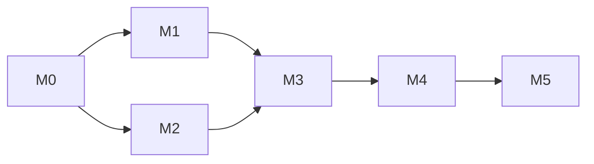

M1 (core loop) and M2 (QR) can partially overlap after M0, but M3 requires both.

---

## 15. Testing Strategy

### Testing Pyramid

| Layer | Tool | Coverage Target |
|-------|------|-----------------|
| Unit tests | XCTest | Domain layer: 80%+ |
| UI tests | XCUITest | Critical paths: 5–8 flows |
| Manual playtests | Scripted | 6, 10, and 16 player sessions |
| Accessibility | Xcode Accessibility Inspector | All P0 screens |

### Unit Tests (Priority)

**Rules Engine:**
- Role distribution for player counts 4, 6, 8, 10, 12, 16
- Shuffle produces uniform random assignment; no duplicate slots
- Correct Insider/Mismatch/Ghost counts for player count with `ghostEnabled: true`
- `ghostEnabled: false` → zero Ghosts at all player counts
- `showRoleOnCard: false` → card API omits role; UI word-only
- Token A cannot fetch Token B's assignment
- Ghost disabled → zero Ghost roles assigned

**Scoring Engine:**
- Insider side win → correct points for survivors and voters
- Mismatch survival → mismatch bonus points
- Ghost guess correct → ghost bonus points
- Ghost guess incorrect → no bonus
- Zero-vote edge case

**QR / Card API:**
- Host creates cards → receives valid HTTPS URLs
- QR image encodes exact URL string
- Web page loads role for valid token
- Expired token returns appropriate error state
- Invalid token rejected

**Profile Stats:**
- Stats increment correctly after session
- Win rate computed correctly
- Streak increments and resets

### UI Tests (Critical Paths)

1. Host creates game → adds 4 players → pass-the-phone reveal → discussion → vote → elimination → reveal
2. Host creates game → API returns card URLs → QR grid displayed
3. Player scans QR URL → web role card loads in browser
4. Session end → session summary displayed; card tokens invalidated
5. Profile created in lobby → stats updated after session

### Manual Playtest Scripts

**6-player session (30 min):**
- Setup time measurement (target ≤ 2 min)
- Play 3 rounds; note any confusion points
- Test pass-the-phone and QR modes separately

**10-player session (45 min):**
- Setup time measurement (target ≤ 3 min)
- Test QR grid usability in bright room
- Test voting flow speed
- Collect "would you play again?" feedback

**16-player session (60 min):**
- Stress test avatar grid, QR generation speed
- Verify role distribution at max scale
- Note any performance issues

### Accessibility Checklist

- [ ] VoiceOver reads all interactive elements on Voting screen
- [ ] Dynamic Type scales Role Card text without clipping
- [ ] All touch targets ≥ 44×44 pt
- [ ] Color is not the only differentiator for roles (icons/badges too)
- [ ] Timer has visual + haptic alerts (not audio-only)

### Performance Targets

| Operation | Target |
|-----------|--------|
| QR generation (16 players) | < 1 second |
| QR scan to Role Card | < 2 seconds |
| App launch to Home | < 1 second |
| SwiftData profile write | < 100ms |

### Privacy Testing

- [ ] Card tokens not exposed in client logs
- [ ] Host app only calls Card API over HTTPS
- [ ] Web card served over HTTPS
- [ ] App Store privacy label accurate (card data stored on server for session duration)

---

## 16. Monetization Ideas

All monetization is **post-MVP**. Launch free to validate product-market fit.

### Recommended Launch Strategy

**Free at launch.** No ads, no IAP, no paywalls. Validate retention and word-of-mouth first.

### Future Revenue Options

| Model | Description | Target | Pros | Cons |
|-------|-------------|--------|------|------|
| **Word pack IAP** | Themed original packs (Office, Travel, Food, Sports, Sci-Fi) | V1.2 | Natural fit; optional content | Requires content pipeline |
| **Host Pro (one-time)** | Custom timers, export stats, custom word pairs, extra Ghost modes | V1.1 | Low friction; targets hosts | Small addressable segment |
| **Tip jar** | StoreKit consumable "Buy the host a coffee" | V1.1 | Goodwill; no feature gating | Unpredictable revenue |
| **Bundle packs** | Multiple word packs at discount | V1.3 | Higher ARPU | Needs enough packs first |

### Explicitly Rejected for This Product

| Model | Reason |
|-------|--------|
| **Ads** | Disrupt party flow; erode trust; wrong context |
| **Subscription** | Party games are episodic; hard to justify recurring cost |
| **Pay-to-win** | Cosmetic or content-only; never gameplay advantages |
| **Loot boxes** | Inappropriate for product values |

### B2B (Far Future)

- Team-building license for companies (bulk word pack + custom branding)
- Event mode for conferences
- Requires sales motion; not relevant until consumer PMF proven

### Revenue Projections (Illustrative, Not Forecast)

Assuming 10K downloads in first 3 months, 5% IAP conversion, $2.99 average pack:
- ~$1,500 gross revenue — sufficient to fund content creation, not a business on its own
- Primary value of monetization: funds ongoing word pack creation and mode development

---

## 17. App Store Positioning

### App Identity

| Field | Value |
|-------|-------|
| **App Name** | Mismatch |
| **Subtitle** | Private role cards for big groups |
| **Bundle ID** | com.[developer].mismatch |
| **Category** | Games > Board |
| **Secondary Category** | Games > Word |
| **Age Rating** | 4+ |

### Keywords (100 characters)

```
party,game,social,deduction,friends,group,word,game night,large group,hidden role,no install
```

Do **not** include competitor names or trademarked terms.

### App Store Description

**First paragraph (above the fold):**

> Mismatch is an original social deduction party game built for groups of 6–16. Each player gets a private role card on their own phone — scan a QR code to open your word in the browser. No app download for guests. **The host can play too** — their secret stays in the app while they run timer, voting, and reveal.

**Feature bullets:**

- QR codes open private web role cards — no player app install for guests
- **Host can play** — in-app My Card on the same phone; no second device
- Host app runs discussion, voting, and elimination
- Pass-the-phone fallback — no player left out
- Built for large groups — fast setup, easy voting, dramatic reveals
- Original word packs — fresh content, not copied from other games
- Session scoring with local player profiles — track wins across game nights
- Players need only a browser; host needs the iOS app (and can join as a player)

**Closing:**

> Mismatch is an original game. It is not affiliated with or endorsed by any existing party game or app.

### Screenshot Plan (6.7" iPhone)

| # | Screen | Caption |
|---|--------|---------|
| 1 | QR Grid (10 players) | "Everyone gets their own private card" |
| 2 | Web role card (hold-to-reveal) | "Your secret in your browser — no app needed" |
| 3 | Discussion timer | "Timed rounds keep the party moving" |
| 4 | Voting (avatar grid) | "Vote fast — even with 16 players" |
| 5 | Reveal (dramatic) | "The moment of truth" |
| 6 | Session Summary (leaderboard) | "Track wins across game nights" |

### App Preview Video (Optional, 15–30 sec)

1. Host creates game (2 sec)
2. Players scan QRs (3 sec)
3. Web role card hold-to-reveal in browser (3 sec)
4. Discussion timer montage (3 sec)
5. Vote → Reveal (4 sec)
6. Session leaderboard (3 sec)
7. Title card: "Mismatch — Everyone knows their secret." (2 sec)

### Privacy Nutrition Label

| Data Type | Collected | Linked to Identity | Used for Tracking |
|-----------|-----------|-------------------|-------------------|
| Gameplay content (role/word) | Yes — server-side for active session cards | No | No |
| User identity | No | — | — |
| Usage analytics | No | — | — |

V1 stores role card data on server for the duration of a session. No player accounts. Host profiles and stats remain on the host device only.

### Review Notes for Apple

> Mismatch is a party game. The host uses the iOS app to run games. Players receive role cards via QR codes that open a webpage — no player app install required. The host app uses the network to create role card links. No user accounts, no third-party SDKs in the host app.

### Launch Strategy

1. **TestFlight beta** — 2–3 friend groups, 2 weeks, collect feedback
2. **Soft launch** — submit to App Store, no marketing spend
3. **Iterate** — address review feedback and beta bugs
4. **Public launch** — social media, party game communities, word of mouth
5. **Measure** — downloads, session completion rate, App Store rating, profile creation rate

### Competitive Positioning Statement (Internal)

> For friend groups who love social deduction games but hate passing phones and forgetting words, Mismatch gives every player a private web role card via QR link — no app download required. The host runs elimination and voting from the iOS app. Unlike generic word game apps, Mismatch is designed for 6–16 players with fast setup and inclusive fallback modes.

---

## Appendix A: Sample Original Word Pairs (Preview)

Examples of the tone and style for the built-in word pack. Final pairs require playtesting.

| Category | Common Word | Mismatch Word |
|----------|-----------|---------------|
| Places | Library | Bookstore |
| Places | Airport | Train Station |
| Food | Pizza | Calzone |
| Food | Sushi | Ceviche |
| Objects | Guitar | Ukulele |
| Objects | Umbrella | Parasol |
| Nature | River | Canal |
| Nature | Volcano | Geyser |
| Professions | Chef | Baker |
| Professions | Pilot | Captain |

All pairs must be original selections — not copied from any existing game's word lists.

---

## Appendix B: Glossary

| Term | Definition |
|------|------------|
| **Insider** | The majority role; players share the same secret word |
| **Mismatch** | The minority role; player has a similar but incorrect word (matches app name) |
| **Ghost** | The wildcard role; player has no word and must bluff |
| **Session** | One continuous sitting of play from setup to Session Summary |
| **Round** | One cycle of discussion, vote, and reveal |
| **Host** | The person whose device runs the session; may also occupy a **PlayerSlot** when **I'm playing** is on |
| **Player Slot** | A named position in the game lobby, assigned a role |
| **Profile** | A locally stored named player used for stat tracking |
| **Word Pack** | A collection of common/Mismatch word pairs |
| **Game Mode** | A complete set of rules registered in the rules engine |
| **Card Pick Reveal** | Player chooses a face-down card to flip; random assignment at distribute; respects **Show role on card** toggle |
| **Show role on card** | Lobby toggle; when off, player cards show word/hint only — role hidden until elimination reveal |
| **Role Token** | Opaque server token embedded in a player's web card URL |
| **Web Role Card** | Mobile web page showing a player's secret role and word |
| **Card API** | Minimal backend that creates and serves role card data |

---

*End of APP_PLAN.md*
