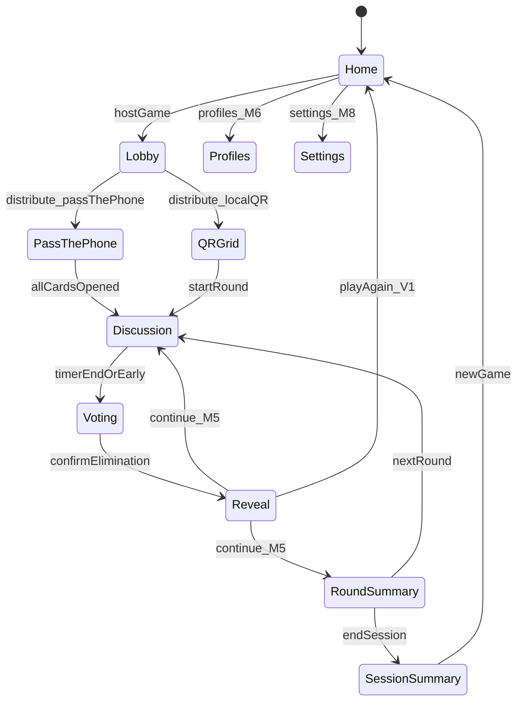
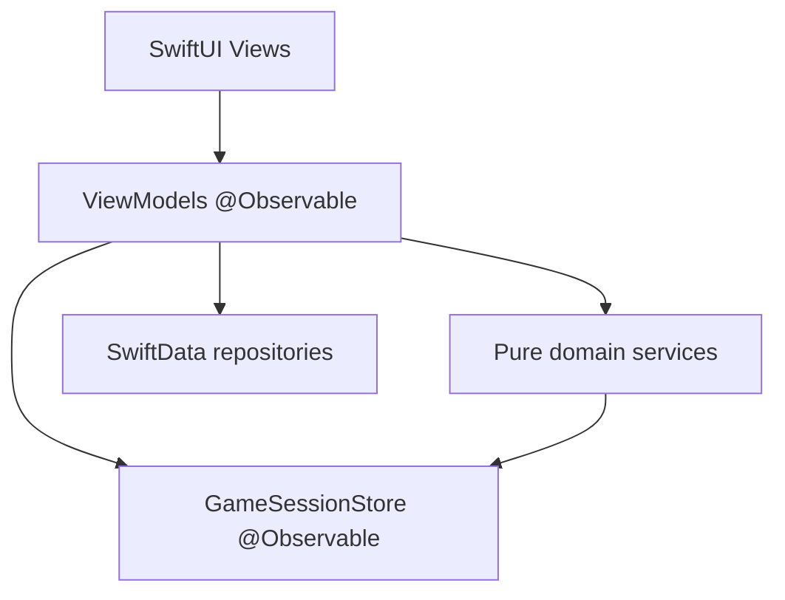
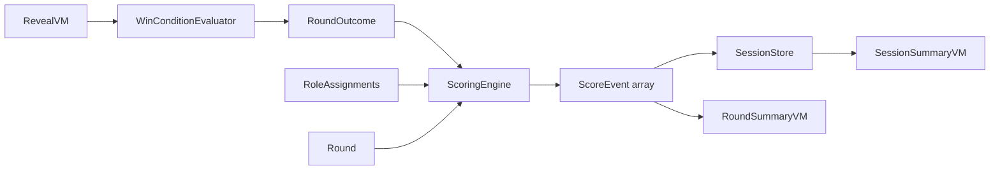
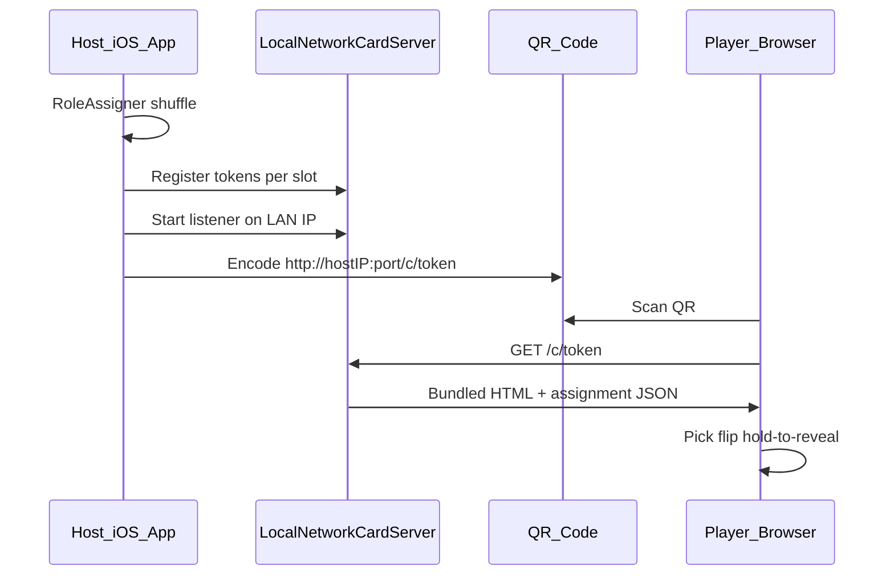
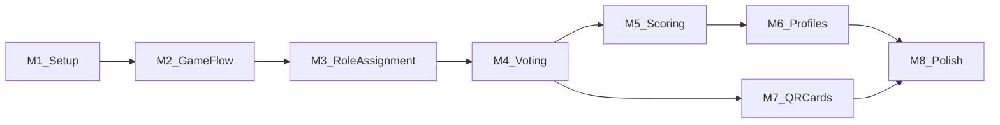

# Mismatch — Development Plan

> **Version:** 1.0  
> **Status:** Pre-development — implementation authority  
> **Platform:** iOS 26+ · SwiftUI · MVVM · SwiftData (V1.5+)  
> **Scope sources:** [FEATURE_SPEC.md](FEATURE_SPEC.md), [APP_PLAN.md](APP_PLAN.md), [MVP_ROADMAP.md](MVP_ROADMAP.md)

This document translates product scope into an actionable iOS implementation plan. It supersedes [APP_PLAN.md](APP_PLAN.md) on **deployment target (iOS 26+)** and **V1 backend strategy (none)**.

---

## V1 Architecture Constraint: No Cloud Backend

[FEATURE_SPEC.md](FEATURE_SPEC.md) describes a cloud Card API for web role cards. **This plan removes cloud backend from V1** to reduce infra risk and ship faster.

| Phase | Card delivery | Network |
|-------|---------------|---------|
| **M1–M4, M8 (V1 TestFlight)** | Pass-the-phone only | Fully offline |
| **M7 (QR Cards)** | Local Network Card Server on host device | Same Wi-Fi LAN only; no cloud |
| **Post–M8 (optional)** | Cloud Card API + static web page | Adds `RemoteCardAPIClient` behind protocol |

**Local Network Card Server (M7):** Host app runs a lightweight HTTP server (Network.framework) on the local network. QR codes encode `http://{host-local-ip}:{port}/c/{token}`. A bundled HTML/JS role card page is served from the host device. Assignments live in an in-memory `LocalCardTokenStore` on the host. Same-room, same-Wi-Fi only. Falls back to pass-the-phone if LAN binding fails.

Cloud Card API remains documented in [APP_PLAN.md § Card URL & QR Design](APP_PLAN.md) as the **V2 upgrade path** when cross-network and bookmarkable public URLs are required.

---

## Document Map

| Section | Purpose |
|---------|---------|
| Folder Structure | Xcode layout |
| Models | Domain + SwiftData types |
| ViewModels | MVVM layer |
| Services | Domain services and protocols |
| Screens | SwiftUI views by feature |
| Navigation | Routing and flow |
| State Management | Session lifecycle |
| SwiftData Strategy | When and what to persist |
| Scoring Architecture | Points engine (M5+) |
| QR Architecture | Local QR + card delivery (M7) |
| Testing Strategy | Unit, UI, manual |
| Milestones 1–8 | Build sequence with DoD |

---

# Folder Structure

Restructure the default Xcode template into feature-based MVVM layout. All paths relative to `mismatch/`.

```
mismatch/
├── App/
│   ├── MismatchApp.swift              # @main, SwiftData container injection
│   ├── AppRouter.swift                # NavigationPath + route enum
│   └── AppDependencies.swift          # Service composition root
│
├── Features/
│   ├── Home/
│   │   ├── HomeView.swift
│   │   └── HomeViewModel.swift
│   ├── Lobby/
│   │   ├── LobbyView.swift
│   │   └── LobbyViewModel.swift
│   ├── Distribution/
│   │   ├── PassThePhone/
│   │   │   ├── PassThePhoneView.swift
│   │   │   └── PassThePhoneViewModel.swift
│   │   ├── QRGrid/
│   │   │   ├── QRGridView.swift
│   │   │   └── QRGridViewModel.swift
│   │   └── MyCard/
│   │       ├── MyCardView.swift
│   │       └── MyCardViewModel.swift
│   ├── GameRound/
│   │   ├── Discussion/
│   │   │   ├── DiscussionView.swift
│   │   │   └── DiscussionViewModel.swift
│   │   ├── Voting/
│   │   │   ├── VotingView.swift
│   │   │   └── VotingViewModel.swift
│   │   ├── Reveal/
│   │   │   ├── RevealView.swift
│   │   │   └── RevealViewModel.swift
│   │   └── RoundSummary/              # M5+
│   │       ├── RoundSummaryView.swift
│   │       └── RoundSummaryViewModel.swift
│   ├── SessionSummary/                # M5+
│   │   ├── SessionSummaryView.swift
│   │   └── SessionSummaryViewModel.swift
│   ├── Profiles/                      # M6+
│   │   ├── ProfilesListView.swift
│   │   ├── ProfileDetailView.swift
│   │   └── ProfilesViewModel.swift
│   └── Settings/                      # M8+
│       ├── SettingsView.swift
│       └── SettingsViewModel.swift
│
├── Domain/
│   ├── Models/                        # Pure Swift structs/enums (no SwiftData)
│   │   ├── GameSession.swift
│   │   ├── PlayerSlot.swift
│   │   ├── RoleAssignment.swift
│   │   ├── GameSettings.swift
│   │   ├── Round.swift
│   │   ├── Vote.swift
│   │   ├── ScoreEvent.swift
│   │   ├── WordPack.swift
│   │   └── GameState.swift
│   ├── RoleAssignment/
│   │   ├── RoleAssigner.swift
│   │   └── RoleDistributionTable.swift
│   ├── Scoring/
│   │   ├── ScoringEngine.swift
│   │   └── ScoringRules.swift
│   ├── RoundLogic/
│   │   ├── WinConditionEvaluator.swift
│   │   └── RoundOutcome.swift
│   └── QR/
│       ├── QRCodeGenerator.swift
│       └── CardURLBuilder.swift
│
├── Services/
│   ├── GameSessionStore.swift         # In-memory session owner (@Observable)
│   ├── CardDelivery/
│   │   ├── CardDeliveryService.swift  # Protocol
│   │   ├── PassThePhoneDeliveryService.swift
│   │   ├── LocalNetworkCardServer.swift   # M7
│   │   └── RemoteCardAPIClient.swift      # Stub; implement post-V1
│   ├── WordPackLoader.swift
│   ├── TimerService.swift
│   ├── SessionSnapshotService.swift   # M8: background recovery
│   └── HapticsService.swift           # M8
│
├── Data/
│   ├── Persistence/
│   │   ├── SwiftDataContainer.swift
│   │   └── Migrations/                # Versioned schema migrations
│   ├── SwiftDataModels/
│   │   ├── PlayerProfileEntity.swift
│   │   ├── PlayerStatsEntity.swift
│   │   ├── SessionHistoryEntity.swift   # V2
│   │   └── AppSettingsEntity.swift      # M8
│   └── Repositories/
│       ├── ProfileRepository.swift
│       ├── SessionHistoryRepository.swift
│       └── SettingsRepository.swift
│
├── DesignSystem/
│   ├── Colors.swift
│   ├── Typography.swift
│   ├── Spacing.swift
│   └── Components/
│       ├── AvatarView.swift
│       ├── PlayerGridView.swift
│       ├── TimerView.swift
│       ├── CardPickView.swift         # Shared pick → flip → hold-to-reveal
│       ├── HoldToRevealView.swift
│       ├── RoleBadgeView.swift
│       └── ConfirmDialog.swift
│
├── Resources/
│   ├── WordPacks/
│   │   └── general.json
│   └── WebCard/                       # M7: bundled role card HTML/JS/CSS
│       ├── index.html
│       ├── card.js
│       └── card.css
│
└── Utilities/
    ├── CryptoRandom.swift             # Fair shuffle for role assignment
    └── UserDefaultsKeys.swift         # First-launch flags
```

**Xcode project groups** mirror this folder tree. Remove default `ContentView.swift` after Home is implemented.

---

# Models

## Domain Models (Pure Swift — M1+)

In-memory only for active session. No SwiftUI or SwiftData imports.

| Model | Key fields | Notes |
|-------|------------|-------|
| `GameSession` | `id`, `createdAt`, `settings`, `state`, `players`, `rounds`, `distributionMode`, `currentRoundIndex`, `sessionPoints` | `sessionPoints` used from M5 |
| `GameState` | Enum: `lobby`, `distributing`, `discussing`, `voting`, `revealing`, `roundSummary`, `sessionSummary`, `ended` | Drives navigation |
| `GameSettings` | `hostIsPlaying`, `ghostEnabled`, `showRoleOnCard`, `ghostMode`, `timerSeconds`, `wordPackId` | Lobby inline toggles |
| `DistributionMode` | Enum: `passThePhone`, `localQR` | V1 default: `passThePhone` |
| `PlayerSlot` | `id`, `displayName`, `avatarColor`, `isHost`, `assignment`, `cardToken`, `cardURL`, `profileId`, `isEliminated`, `hasOpenedCard`, `sessionScore` | Assignment nil until distribute |
| `RoleAssignment` | `role`, `word`, `categoryHint` | Bound 1:1 to slot after distribute |
| `Role` | Enum: `insider`, `mismatch`, `ghost` | |
| `Round` | `index`, `eliminatedPlayerId`, `votes`, `outcome`, `scoreEvents`, `ghostGuess` | |
| `Vote` | `voterId`, `targetId` | V1: optional; host consensus only |
| `ScoreEvent` | `playerId`, `points`, `reason` | M5+ |
| `ScoreReason` | Enum: `survived`, `mismatchSurvived`, `ghostSurvived`, `ghostGuess`, … | Max 4 rules in V1.5 |
| `RoundOutcome` | Enum: `insiderSideWins`, `mismatchWins`, `ghostWins` | |
| `WordPack` | `id`, `displayName`, `pairs`, `isBuiltIn` | Loaded from JSON |
| `WordPair` | `id`, `insiderWord`, `mismatchWord`, `category` | |
| `AvatarColor` | Enum or named palette | Design system aligned |

## SwiftData Models (M5–M6+)

| Entity | Key fields | Milestone |
|--------|------------|-----------|
| `PlayerProfileEntity` | `id`, `name`, `avatarColorRaw`, `createdAt` | M6 |
| `PlayerStatsEntity` | `profileId`, `gamesPlayed`, `winsAsInsider`, `winsAsMismatch`, `winsAsGhost`, `totalPoints`, `currentStreak`, `bestStreak` | M6 |
| `SessionHistoryEntity` | `id`, `completedAt`, `playerNamesJSON`, `roundsJSON`, `leaderboardJSON` | V2 |
| `AppSettingsEntity` | `defaultTimerSeconds`, `hapticsEnabled`, `hasSeenInlineRules` | M8 |

Domain models and SwiftData entities stay separate. Repositories map between them — never expose `@Model` types to ViewModels directly.

## Local Card Token (M7)

| Model | Key fields | Storage |
|-------|------------|---------|
| `LocalCardToken` | `token`, `sessionId`, `playerSlotId`, `role`, `word`, `categoryHint`, `showRoleOnCard`, `pickedAt`, `expiresAt` | In-memory dict on host; served by LocalNetworkCardServer |

---

# ViewModels

All ViewModels use `@Observable` (iOS 26 Observation framework). One primary ViewModel per screen. ViewModels coordinate services; they do not import SwiftUI.

| ViewModel | Owns | Key actions |
|-----------|------|-------------|
| `HomeViewModel` | First-launch state | Start new game, resume active session (M8) |
| `LobbyViewModel` | Player list draft, settings toggles | Add/remove players, toggle Ghost / Show role / I'm playing, select distribution mode, trigger distribute |
| `PassThePhoneViewModel` | Current pass index, card-pick state | Advance pass order, enforce Hide & pass |
| `QRGridViewModel` | QR images per slot, server status | Start/stop LocalNetworkCardServer, copy link, enlarge QR |
| `MyCardViewModel` | Host card-pick state | Pick, flip, hold-to-reveal for host slot |
| `DiscussionViewModel` | Timer remaining | Start/pause timer, end early, open My Card sheet |
| `VotingViewModel` | Selected player ID | Select, confirm, submit elimination |
| `RevealViewModel` | Eliminated player, outcome | Show reveal animation, round winner text; ghost guess (M5+) |
| `RoundSummaryViewModel` | Round score events | Continue to next round (M5+) |
| `SessionSummaryViewModel` | Session leaderboard | End session, write profile stats (M6) |
| `ProfilesViewModel` | Profile list | CRUD, link to lobby slot |
| `SettingsViewModel` | App preferences | Timer default, haptics (M8) |

**Shared dependency:** All game-round ViewModels read/write through `GameSessionStore` — single source of truth for active session.

---

# Services

| Service | Responsibility | Milestone |
|---------|----------------|-----------|
| `GameSessionStore` | Create, mutate, reset `GameSession`; publish state changes | M1 |
| `RoleAssigner` | Pick word pair, build role pool, crypto shuffle, map to slots | M3 |
| `RoleDistributionTable` | Player count → Insider/Mismatch/Ghost counts | M3 |
| `WordPackLoader` | Load and cache bundled `general.json` | M1 |
| `WinConditionEvaluator` | Determine `RoundOutcome` from elimination + ghost guess | M2 |
| `ScoringEngine` | Compute `[ScoreEvent]` from round result + assignments | M5 |
| `TimerService` | Countdown with tick callbacks; supports fixed (V1) and configurable (M8) | M2 |
| `CardDeliveryService` | Protocol: `distribute(session:)`, `invalidate(session:)` | M3 |
| `PassThePhoneDeliveryService` | Marks assignments ready; no network | M3 |
| `LocalNetworkCardServer` | HTTP server on LAN; serves bundled web card + token API | M7 |
| `RemoteCardAPIClient` | Stub conforming to `CardDeliveryService`; cloud path for V2 | M7 stub |
| `QRCodeGenerator` | CoreImage CIQRCodeGenerator from URL string | M7 |
| `CardURLBuilder` | Build local or remote card URLs from token + host IP | M7 |
| `ProfileRepository` | SwiftData CRUD for profiles + stats | M6 |
| `SessionSnapshotService` | Encode/decode active session for background recovery | M8 |
| `HapticsService` | Timer warning haptics | M8 |
| `SettingsRepository` | Persist app settings via SwiftData | M8 |

### Service composition (`AppDependencies`)

Created once at app launch. Injected into ViewModels via environment or initializer.

```
AppDependencies
├── gameSessionStore
├── roleAssigner
├── wordPackLoader
├── scoringEngine          (M5)
├── cardDeliveryService    (protocol; impl swapped M3/M7)
├── profileRepository      (M6)
├── timerService
└── settingsRepository     (M8)
```

---

# Screens

| Screen | View | Phase | V1 visible |
|--------|------|-------|------------|
| Home | `HomeView` | M1 | Yes |
| Lobby | `LobbyView` | M1 | Yes |
| Pass-the-Phone | `PassThePhoneView` | M3 | Yes |
| My Card (sheet) | `MyCardView` | M3 | Yes |
| Discussion | `DiscussionView` | M2 | Yes |
| Voting | `VotingView` | M4 | Yes |
| Reveal + End | `RevealView` | M2 | Yes |
| QR Grid | `QRGridView` | M7 | Yes (after M7) |
| Round Summary | `RoundSummaryView` | M5 | V1.5 |
| Session Summary | `SessionSummaryView` | M5 | V1.5 |
| Profiles List | `ProfilesListView` | M6 | V1.5 |
| Profile Detail | `ProfileDetailView` | M6 | V1.5 |
| Settings | `SettingsView` | M8 | V1.5 |
| How to Play | `HowToPlayView` | M8 | V1.5 |

**Bundled web (M7):** Not a SwiftUI screen — static HTML served by `LocalNetworkCardServer`. Same card-pick UX as native `CardPickView`.

---

# Navigation

## Router design

`AppRouter` holds a `NavigationPath` and an optional **full-screen cover** for game flow (lobby → round loop is modal to keep Home clean).



## Route enum

| Route | Presentation |
|-------|--------------|
| `.lobby` | `navigationDestination` or full-screen cover |
| `.passThePhone` | Push |
| `.qrGrid` | Push |
| `.discussion` | Push (back disabled mid-round) |
| `.voting` | Push |
| `.reveal` | Push |
| `.roundSummary` | Push (M5) |
| `.sessionSummary` | Push (M5) |
| `.profiles` | Push from Home |
| `.profileDetail(id)` | Push |
| `.settings` | Push from Home |
| `.myCard` | Sheet from Discussion / Voting / QR Grid |

## Navigation rules

- Back gesture disabled during `discussing`, `voting`, `revealing` to prevent accidental state loss.
- **Play Again (V1):** Reset session via `GameSessionStore.reset()` → return to Lobby.
- **New Game:** Pop to Home, clear session.
- Deep links: not supported in V1.

---

# State Management

## Layers



## GameSessionStore

- **Owner** of the active `GameSession` (in-memory).
- Exposes: `currentSession`, `hasActiveSession`, `phase`.
- Mutations: `createSession(settings:)`, `addPlayer`, `removePlayer`, `distributeRoles()`, `eliminate(playerId:)`, `advancePhase()`, `reset()`.
- ViewModels call store methods; Views observe store through ViewModels.
- Assignments live on `PlayerSlot.assignment` after distribute — **never** exposed in Lobby or QR Grid UI before reveal.

## Phase transitions

| From | Trigger | To |
|------|---------|-----|
| `lobby` | Distribute Roles | `distributing` |
| `distributing` | All cards opened | `discussing` |
| `discussing` | Timer end / End Early | `voting` |
| `voting` | Confirm elimination | `revealing` |
| `revealing` | Continue (M5) | `roundSummary` → `discussing` |
| `revealing` | Play Again (V1) | `lobby` (reset round) |
| `revealing` | End Session (M5) | `sessionSummary` |

## Concurrency

- All session mutations on `@MainActor`.
- `RoleAssigner` shuffle and `ScoringEngine` math are synchronous pure functions (testable off main actor).
- `LocalNetworkCardServer` runs Network.framework listener on background queue; publishes card fetch results to `@MainActor`.

## Secret isolation enforcement

- QR Grid and Lobby ViewModels receive `PlayerSlot` **without** `assignment` exposed — use a `PlayerSlotDisplayModel` that omits secrets.
- Reveal ViewModel receives full assignment for eliminated player only.
- Code review checklist: no `assignment.word` in Lobby/QRGrid/Discussion/Voting views.

---

# SwiftData Strategy

## When to introduce SwiftData

| Milestone | SwiftData usage |
|-----------|-----------------|
| M1–M4 | **None.** In-memory session only. |
| M5 | Optional: persist completed session stub for scoring QA |
| M6 | **PlayerProfileEntity**, **PlayerStatsEntity** |
| M8 | **AppSettingsEntity**; optional session snapshot blob |

## Container setup

- Initialize `ModelContainer` in `MismatchApp` with schema version 1.
- Inject `ModelContext` into repositories via `AppDependencies`.
- Use `#Predicate` and `@Query` only in Profile/Settings views — not in game-round flow.

## Migration plan

| Version | Change |
|---------|--------|
| v1 | Initial: Profile + Stats + AppSettings |
| v2 | Add SessionHistoryEntity |
| v3 | Cloud sync fields (V2 product) |

Write migration unit tests before schema v2. Versioned models from day one of M6.

## Profile ↔ slot linking

- `PlayerSlot.profileId` references `PlayerProfileEntity.id` (optional).
- On Session Summary (M6): `ProfileRepository.applySessionStats(session:linkedProfiles:)`.
- Unlinked slots: session score shown; no SwiftData write.

---

# Scoring Architecture

Implemented in **Milestone 5** ([FEATURE_SPEC.md §4](FEATURE_SPEC.md) — V1.5 product scope).

## Components



## V1.5 scoring rules (max 4 types at launch)

| Rule | Points | Condition |
|------|--------|-----------|
| Survived | +1 | Not eliminated this round |
| Mismatch survived | +3 | Mismatch role + not eliminated |
| Ghost survived | +2 | Ghost role + not eliminated |
| Ghost word guess | +5 | Correct guess on reveal |

`ScoringEngine.computeRoundScores(round:assignments:settings:) -> [ScoreEvent]`

- Pure function; no side effects.
- Accumulates into `PlayerSlot.sessionScore` on `GameSessionStore`.
- Session Summary sorts by `sessionScore` descending for leaderboard.

## Deferred scoring rules

Correct-vote bonus (+2) and misdirection bonus (+1) require per-voter tracking (V1.5 conditional per [FEATURE_SPEC.md](FEATURE_SPEC.md)). Add only if playtest demands.

## V1 (M2–M4) behavior

`RevealView` displays `RoundOutcome` as human-readable text only — no `ScoringEngine` call.

---

# QR Architecture

Implemented in **Milestone 7**. No cloud backend in V1.

## V1: Local Network Card Server



## CardDeliveryService protocol

```
protocol CardDeliveryService {
    func prepareDistribution(session: GameSession) async throws -> [PlayerSlot]
    func invalidate(sessionId: UUID) async
    var isAvailable: Bool { get }
}
```

| Implementation | When | Notes |
|----------------|------|-------|
| `PassThePhoneDeliveryService` | M3 | Default V1; always available |
| `LocalNetworkCardServer` | M7 | Same Wi-Fi; serves bundled WebCard |
| `RemoteCardAPIClient` | Post-V1 | Cloud path; stub in M7 |

## QR generation

- `QRCodeGenerator.generate(from url: String) -> CGImage?`
- CoreImage `CIQRCodeGenerator`; scale for display density
- URL format (local V1): `http://{bonjourOrManualIP}:{port}/c/{token}`
- URL format (future cloud): `https://play.mismatch.app/c/{token}`

## Token store

- `LocalCardTokenStore`: `[String: LocalCardToken]` in memory on host
- Token: 128-bit random hex (CryptoKit)
- `GET /c/{token}` returns assignment JSON; omits `role` when `showRoleOnCard == false`
- `POST /c/{token}/picked` records first flip (idempotent)
- Tokens invalidated on session end or New Game

## Bundled web card (`Resources/WebCard/`)

- Vanilla HTML/CSS/JS — no build toolchain required for V1
- Mobile-responsive; touch hold-to-reveal via JS
- Fetches assignment from same origin (local server)
- Parity with native `CardPickView` interaction

## Fallback chain

1. Local QR (M7) if server starts and players on same Wi-Fi
2. Pass-the-phone (always available, one tap from QR Grid error state)
3. Copy link (local URL) for manual browser entry

## Secret isolation

- Server returns **one** token's data per request
- Host QR Grid UI uses display models without assignments
- Host-player uses native `MyCardView`, not browser

## V2 upgrade path

Replace `LocalNetworkCardServer` with `RemoteCardAPIClient` behind same protocol. Deploy static web card to CDN; point `CardURLBuilder` to production domain. Local server remains as offline fallback.

---

# Testing Strategy

## Pyramid

| Layer | Tool | Target |
|-------|------|--------|
| Unit | Swift Testing / XCTest | Domain + services: 80%+ on RoleAssigner, ScoringEngine, WinConditionEvaluator |
| UI | XCUITest | 5–8 critical host flows |
| Manual | Playtest scripts | 6, 10, 16 players |
| Accessibility | Accessibility Inspector | M8 pass |

## Unit tests (priority)

**M3 — RoleAssigner**
- Distribution counts for player counts 4, 6, 8, 10, 12, 16
- `ghostEnabled: false` → zero Ghosts
- `ghostEnabled: true` → table counts match [FEATURE_SPEC.md](FEATURE_SPEC.md)
- Shuffle does not duplicate assignments

**M4 — WinConditionEvaluator**
- Insider side win when Mismatch eliminated
- Mismatch win when Mismatch survives
- Ghost win on correct word guess (M5)

**M5 — ScoringEngine**
- Each score rule fires correctly
- Session totals accumulate over 3 rounds
- Edge: all eliminated, zero survivors

**M7 — QRCodeGenerator + CardURLBuilder**
- QR encodes exact URL string
- Invalid token returns 404 from local server
- Token A cannot fetch Token B assignment

**M6 — ProfileRepository**
- Stats increment after session
- Win rate computation edge cases

## UI tests (critical paths)

1. Home → Lobby → add 4 players → pass-the-phone → discussion → vote → reveal → Play Again
2. Lobby → distribute → discussion → vote → reveal → round winner text visible
3. M7: QR Grid renders N QR codes; copy link button present
4. M5: Multi-round → Session Summary → leaderboard order
5. M6: Link profile in Lobby → stats update after session

## Manual playtest gates

| Gate | When | Criteria |
|------|------|----------|
| Playtest Gate 1 | After M4 | 6 players, pass-the-phone; game is fun; rules understood |
| Playtest Gate 2 | After M7 | 10 players, local QR; setup ≤ 3 min |
| TestFlight Gate | After M8 | [MVP_ROADMAP.md § TestFlight Readiness](MVP_ROADMAP.md) |

## Performance targets

| Operation | Target |
|-----------|--------|
| QR generation (16 players) | < 1 s |
| Local card page load | < 2 s on LAN |
| App launch → Home | < 1 s |
| SwiftData profile write | < 100 ms |

---

# Milestone 1 — Project Setup

## Goal

Establish Xcode project structure, design system, domain model skeleton, word pack loader, and navigation shell. No playable game yet.

## Files affected

| Action | Path |
|--------|------|
| Create | `App/MismatchApp.swift`, `App/AppRouter.swift`, `App/AppDependencies.swift` |
| Create | `Features/Home/HomeView.swift`, `HomeViewModel.swift` |
| Create | `Domain/Models/*` (all core structs/enums) |
| Create | `Services/GameSessionStore.swift`, `WordPackLoader.swift` |
| Create | `DesignSystem/*`, `DesignSystem/Components/AvatarView.swift` |
| Create | `Resources/WordPacks/general.json` (30 pairs) |
| Create | `Utilities/CryptoRandom.swift` |
| Modify | `mismatch.xcodeproj/project.pbxproj` (folder groups, iOS 26 deployment target) |
| Delete | `ContentView.swift` (after Home replaces it) |

## Estimated complexity

**Medium** — 3–5 days

## Definition of done

- [ ] iOS 26+ deployment target set; zero third-party dependencies
- [ ] Folder structure matches plan; builds clean on simulator and device
- [ ] Home screen renders with "Host Game" CTA
- [ ] All domain models compile; no SwiftData yet
- [ ] `general.json` loads 30 word pairs via `WordPackLoader` unit test
- [ ] Design tokens (colors, typography, avatar palette) used on Home
- [ ] `AppRouter` navigates Home → empty Lobby placeholder
- [ ] `GameSessionStore` creates empty session in memory
- [ ] Unit test target runs in CI / locally

---

# Milestone 2 — Game Flow

## Goal

Playable single-round loop: Lobby (basic) → pass-the-phone placeholder distribute → Discussion (fixed 3-min timer) → Reveal with round winner text. Role assignment is stubbed (hardcoded test words) until M3.

## Files affected

| Action | Path |
|--------|------|
| Create | `Features/Lobby/LobbyView.swift`, `LobbyViewModel.swift` |
| Create | `Features/GameRound/Discussion/*`, `Reveal/*` |
| Create | `Domain/RoundLogic/WinConditionEvaluator.swift`, `RoundOutcome.swift` |
| Create | `Services/TimerService.swift` |
| Create | `DesignSystem/Components/TimerView.swift` |
| Modify | `App/AppRouter.swift` (game flow routes) |
| Modify | `Services/GameSessionStore.swift` (phase transitions) |

## Estimated complexity

**Medium** — 4–6 days

## Definition of done

- [ ] Lobby: add/remove players (names + avatar colors), minimum 4 to start
- [ ] **I'm playing** toggle adds **You** slot (default on)
- [ ] Inline settings: Ghost (off), Show role on card (off), distribution mode
- [ ] Stub distribute assigns test words → Discussion starts
- [ ] Discussion: 3-minute countdown, End Early → Voting placeholder or skip to Reveal for M2
- [ ] Reveal: shows eliminated player role + word (stub elimination: first Mismatch found)
- [ ] Round winner text displayed (e.g. "Insider side wins")
- [ ] **Play Again** resets to Lobby; **New Game** returns Home
- [ ] Phase transitions enforced via `GameSessionStore`
- [ ] Unit tests: `WinConditionEvaluator` for Insider win and Mismatch win

---

# Milestone 3 — Role Assignment

## Goal

Real random role assignment, word pair selection, pass-the-phone distribution with card-pick UX, and host My Card sheet. Fully offline playable game.

## Files affected

| Action | Path |
|--------|------|
| Create | `Domain/RoleAssignment/RoleAssigner.swift`, `RoleDistributionTable.swift` |
| Create | `Services/CardDelivery/CardDeliveryService.swift`, `PassThePhoneDeliveryService.swift` |
| Create | `Features/Distribution/PassThePhone/*`, `MyCard/*` |
| Create | `DesignSystem/Components/CardPickView.swift`, `HoldToRevealView.swift`, `RoleBadgeView.swift` |
| Modify | `Features/Lobby/LobbyViewModel.swift` (trigger real distribute) |
| Modify | `Domain/Models/PlayerSlot.swift` (assignment binding) |
| Modify | `Services/GameSessionStore.swift` (`distributeRoles()`) |

## Estimated complexity

**Medium–High** — 5–7 days

## Definition of done

- [ ] `RoleAssigner` picks random word pair, builds role pool, shuffles, maps to slots
- [ ] Ghost toggle: off → 0 Ghosts; on → table counts per [FEATURE_SPEC.md](FEATURE_SPEC.md)
- [ ] Pass-the-phone: sequential pass order, card pick → flip → hold-to-reveal → Hide & pass
- [ ] Host included in pass order when **I'm playing** on (host last recommended)
- [ ] My Card sheet: same pick UX for host-player slot
- [ ] Show role on card toggle respected on flip UI
- [ ] Secret isolation: Lobby and pass flow never show other players' words
- [ ] Full round completable offline: distribute → discuss → vote (M4 may parallel) → reveal
- [ ] Unit tests: role distribution for 4, 6, 8, 10, 12, 16 players
- [ ] **Playtest Gate 1 ready:** 6-player pass-the-phone session

---

# Milestone 4 — Voting

## Goal

Host-side elimination voting with avatar grid, confirmation, and integration into reveal flow. Eliminated state persists through round.

## Files affected

| Action | Path |
|--------|------|
| Create | `Features/GameRound/Voting/VotingView.swift`, `VotingViewModel.swift` |
| Create | `DesignSystem/Components/PlayerGridView.swift`, `ConfirmDialog.swift` |
| Modify | `Features/GameRound/Discussion/DiscussionViewModel.swift` (navigate to voting) |
| Modify | `Features/GameRound/Reveal/RevealViewModel.swift` (receive eliminated player) |
| Modify | `Services/GameSessionStore.swift` (`eliminate(playerId:)`) |
| Modify | `App/AppRouter.swift` (Discussion → Voting → Reveal) |

## Estimated complexity

**Medium** — 3–4 days

## Definition of done

- [ ] Voting screen: avatar grid of active (non-eliminated) players
- [ ] Tap select → confirmation dialog → submit
- [ ] Host can select **You** slot; no immunity
- [ ] All touch targets ≥ 44×44 pt
- [ ] Eliminated player marked; flows to Reveal with correct role + word
- [ ] Round winner text matches `WinConditionEvaluator` outcome
- [ ] Grid renders correctly for 4–16 players
- [ ] Back navigation disabled during voting phase
- [ ] **Playtest Gate 1 passed:** ≥ 1 group completes 6-player session; game is fun

---

# Milestone 5 — Scoring

## Goal

Multi-round sessions, scoring engine, Round Summary, Session Summary, and session leaderboard. V1.5 retention core.

## Files affected

| Action | Path |
|--------|------|
| Create | `Domain/Scoring/ScoringEngine.swift`, `ScoringRules.swift` |
| Create | `Features/GameRound/RoundSummary/*`, `SessionSummary/*` |
| Modify | `Features/GameRound/Reveal/RevealView.swift` (Continue vs End Session; ghost guess prompt) |
| Modify | `Domain/Models/GameSession.swift` (`sessionPoints`, multi-round) |
| Modify | `Domain/Models/PlayerSlot.swift` (`sessionScore`) |
| Modify | `Services/GameSessionStore.swift` (round accumulation) |
| Modify | `App/AppRouter.swift` (roundSummary, sessionSummary routes) |

## Estimated complexity

**Medium–High** — 5–7 days

## Definition of done

- [ ] Reveal → **Continue** starts next round (same players, new word/roles)
- [ ] Reveal → **End Session** → Session Summary
- [ ] `ScoringEngine` implements 4 core rules per [FEATURE_SPEC.md](FEATURE_SPEC.md)
- [ ] Round Summary shows points earned per player for the round
- [ ] Session Summary shows ranked leaderboard by total session points
- [ ] Ghost word-guess prompt on Reveal; +5 points on correct guess
- [ ] Unit tests: scoring math for all 4 rules; 3-round accumulation
- [ ] Ties on leaderboard handled consistently (document behavior in code comment)
- [ ] V1 **Play Again** (single round) still works when ending after round 1

---

# Milestone 6 — Player Profiles

## Goal

SwiftData-backed local named profiles, lobby linking, profile list/detail screens, and stat writes at session end.

## Files affected

| Action | Path |
|--------|------|
| Create | `Data/Persistence/SwiftDataContainer.swift` |
| Create | `Data/SwiftDataModels/PlayerProfileEntity.swift`, `PlayerStatsEntity.swift` |
| Create | `Data/Repositories/ProfileRepository.swift` |
| Create | `Features/Profiles/ProfilesListView.swift`, `ProfileDetailView.swift`, `ProfilesViewModel.swift` |
| Modify | `App/MismatchApp.swift` (ModelContainer injection) |
| Modify | `Features/Lobby/LobbyView.swift` (profile picker per slot) |
| Modify | `Features/SessionSummary/SessionSummaryViewModel.swift` (write stats) |
| Modify | `App/AppRouter.swift` (Home → Profiles) |

## Estimated complexity

**High** — 5–7 days

## Definition of done

- [ ] SwiftData schema v1: Profile + Stats entities
- [ ] Create, edit, delete profiles from Profiles List
- [ ] Profile Detail: games played, wins by role, total points, win rate
- [ ] Lobby: link slot to profile (optional per player)
- [ ] Session Summary writes stats to linked profiles
- [ ] Unlinked slots: session score shown; no profile write
- [ ] Stats persist across app restart
- [ ] UX copy: *"Stats saved on this device"*
- [ ] Unit tests: stat increment, win rate edge cases (0 games)
- [ ] Migration strategy documented in `Data/Persistence/Migrations/`

---

# Milestone 7 — QR Cards

## Goal

Local Network Card Server, QR Grid, bundled web role card, and card delivery abstraction — **no cloud backend**. Pass-the-phone remains fallback.

## Files affected

| Action | Path |
|--------|------|
| Create | `Services/CardDelivery/LocalNetworkCardServer.swift`, `LocalCardTokenStore.swift` |
| Create | `Services/CardDelivery/RemoteCardAPIClient.swift` (stub) |
| Create | `Domain/QR/QRCodeGenerator.swift`, `CardURLBuilder.swift` |
| Create | `Features/Distribution/QRGrid/QRGridView.swift`, `QRGridViewModel.swift` |
| Create | `Resources/WebCard/index.html`, `card.js`, `card.css` |
| Modify | `Features/Lobby/LobbyViewModel.swift` (localQR distribution mode) |
| Modify | `App/AppDependencies.swift` (inject CardDeliveryService impl) |
| Modify | `App/AppRouter.swift` (Lobby → QRGrid → Discussion) |

## Estimated complexity

**High** — 8–12 days

## Definition of done

- [ ] `CardDeliveryService` protocol with PassThePhone + LocalNetwork implementations
- [ ] LocalNetworkCardServer starts on LAN; serves bundled web card
- [ ] QR Grid: one QR per non-host player; **You** row → View My Card
- [ ] QR encodes local URL; scannable by player phone camera
- [ ] Web card: pick → flip → hold-to-reveal; respects Show role on card
- [ ] Token isolation: wrong token → error page
- [ ] Copy link per player works for manual browser entry
- [ ] Server fail → one-tap pass-the-phone fallback
- [ ] Host-player uses native My Card (not browser)
- [ ] QR Grid shows names + QR only — no secrets
- [ ] Unit tests: QR encodes URL; token isolation
- [ ] **Playtest Gate 2:** 10 players on same Wi-Fi; setup ≤ 3 min
- [ ] `RemoteCardAPIClient` stub documented for V2 cloud migration

---

# Milestone 8 — Polish & TestFlight

## Goal

Production-quality polish, settings, accessibility, session recovery, TestFlight-ready build. Targets App Store path (V1.5 feature-complete per [FEATURE_SPEC.md](FEATURE_SPEC.md)).

## Files affected

| Action | Path |
|--------|------|
| Create | `Features/Settings/SettingsView.swift`, `SettingsViewModel.swift` |
| Create | `Data/SwiftDataModels/AppSettingsEntity.swift` |
| Create | `Data/Repositories/SettingsRepository.swift` |
| Create | `Services/SessionSnapshotService.swift`, `HapticsService.swift` |
| Modify | `Features/Home/HomeView.swift` (inline rules first launch) |
| Modify | `DesignSystem/Components/TimerView.swift` (configurable 1–5 min) |
| Modify | `Features/GameRound/Voting/*` (tie vote / revote — if playtest flagged) |
| Modify | `Assets.xcassets/AppIcon.appiconset/` |
| Modify | All P0 screens (accessibility labels, Dynamic Type, empty/error states) |

## Estimated complexity

**Medium–High** — 5–8 days

## Definition of done

- [ ] App icon and launch screen set
- [ ] Inline rules on first launch (3 bullets)
- [ ] Settings: default timer, haptics toggle
- [ ] Configurable timer 1–5 min in Lobby
- [ ] Haptic warnings at 30s and 10s on Discussion timer
- [ ] Session snapshot: host backgrounding mid-round → resume on foreground
- [ ] Share card link via iOS share sheet (local URL)
- [ ] VoiceOver labels on Voting and Lobby
- [ ] Dynamic Type does not clip on Reveal or Voting
- [ ] 16-player UI verified; scroll performance acceptable
- [ ] No debug logging of roles, words, or tokens in Release
- [ ] Privacy: App Store nutrition label accurate (local network in V1)
- [ ] TestFlight build uploaded; beta instructions documented
- [ ] [MVP_ROADMAP.md § TestFlight Readiness Checklist](MVP_ROADMAP.md) complete
- [ ] Known limitation documented: local QR requires same Wi-Fi; cloud URLs in V2

---

## Milestone Dependency Graph



**Critical path to offline playable:** M1 → M2 → M3 → M4  
**Critical path to TestFlight (full V1.5):** M1 → … → M8  
**Parallel opportunity:** M7 can start after M4 (does not require M5/M6)

---

## Scope Cross-Reference

| Topic | FEATURE_SPEC | This plan |
|-------|--------------|-----------|
| V1 backend | Cloud Card API | **None** — local network server in M7 |
| iOS minimum | iOS 17+ (APP_PLAN) | **iOS 26+** |
| Scoring | V1.5 | M5 |
| Profiles | V1.5 | M6 |
| QR web cards | V1 cloud | M7 local LAN |
| TestFlight | V1 | M8 (after M5–M7 for V1.5 scope) |
| GameMode protocol | V2 | Not in milestones; hardcoded Classic |

---

## Estimated Total Timeline

| Milestone | Days (solo) |
|-----------|-------------|
| M1 | 3–5 |
| M2 | 4–6 |
| M3 | 5–7 |
| M4 | 3–4 |
| M5 | 5–7 |
| M6 | 5–7 |
| M7 | 8–12 |
| M8 | 5–8 |
| **Total** | **38–56 days (~8–11 weeks)** |

M7 and M5–M6 can partially overlap if M7 starts after M4 while M5–M6 proceed on main branch.

---

*End of DEVELOPMENT_PLAN.md*
