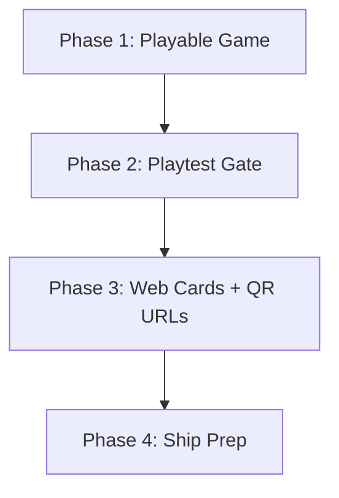

# Mismatch — MVP Roadmap

> **Purpose:** Ruthless scope control for Mismatch V1.  
> **Source:** Derived from [APP_PLAN.md](APP_PLAN.md)  
> **Principle:** Validate the core idea before building retention, architecture, or polish.

**Core hypothesis to validate:**

> Groups of 6–12 players will prefer **QR links to private web role cards** (no player app install) over passing one phone — and will finish a full round with the host running elimination from the iOS app.

**Platform split:**

| Who | Needs Mismatch iOS app? | Needs browser? |
|-----|-------------------------|----------------|
| **Host** | **Yes** — lobby, QR grid, timer, vote, **elimination**, reveal | No |
| **Player** | **No** | **Yes** — scan QR → web role card |

**What V1 is NOT:** A player-facing iOS app, a feature-complete party platform, or a fully offline product.

### Role names (Insider · Mismatch · Ghost)

| Role | Game function |
|------|---------------|
| **Insider** | Majority — has the true secret word |
| **Mismatch** | Minority — has a similar but wrong word (matches app name) |
| **Ghost** | Wildcard — no word (optional category hint) |

---

## Scoring Key

| Dimension | 1 | 10 |
|-----------|---|-----|
| **User Value** | Nice-to-have | Solves a top pain point |
| **Development Complexity** | Trivial | Multi-week, high risk |
| **Risk** | Unlikely to cause problems | Likely to fail or delay launch |
| **MVP Necessity** | Not needed to validate hypothesis | Required to validate hypothesis |

---

## Feature Scorecard

Every feature proposed in APP_PLAN.md, rated honestly.

### Core Gameplay

| Feature | User Value | Complexity | Risk | MVP Necessity | Tier |
|---------|:----------:|:----------:|:----:|:-------------:|:----:|
| Insider + Mismatch roles | 10 | 4 | 2 | 10 | V1 |
| Role assignment by player count | 9 | 4 | 2 | 10 | V1 |
| Word pack (bundled JSON) | 8 | 3 | 4 | 9 | V1 |
| Full round loop (discuss → vote → reveal) | 10 | 5 | 3 | 10 | V1 |
| Discussion timer (fixed 3 min) | 7 | 3 | 1 | 7 | V1 |
| Host-side elimination vote | 8 | 4 | 3 | 8 | V1 |
| Reveal screen (role + word) | 9 | 3 | 1 | 9 | V1 |
| Ghost role (optional toggle) | 6 | 4 | 4 | 5 | V1 (off by default) |
| Ghost word guess on reveal | 5 | 3 | 3 | 4 | V1.5 |
| Ghost Category Hint mode | 6 | 3 | 3 | 3 | V1.5 |
| Scaled Mismatch + Ghost counts by player count | 8 | 4 | 2 | 9 | V1 |
| Multi-round sessions | 7 | 4 | 3 | 6 | V1.5 |
| Tie vote / revote logic | 5 | 4 | 4 | 4 | V1.5 |
| Configurable timer (1–5 min) | 4 | 2 | 1 | 3 | V1.5 |
| 50–100 word pairs | 5 | 4 | 5 | 4 | V1.5 |

### Role Distribution

| Feature | User Value | Complexity | Risk | MVP Necessity | Tier |
|---------|:----------:|:----------:|:----:|:-------------:|:----:|
| **QR link to web role card** | 10 | 6 | 5 | 10 | V1 |
| **Card pick reveal (web + pass-the-phone)** | 10 | 5 | 3 | 10 | V1 |
| **Random role shuffle at distribute** | 9 | 3 | 1 | 10 | V1 |
| **Show role on card** toggle (default off) | 7 | 2 | 1 | 8 | V1 |
| **Ghost auto-scaling** (count by players when Ghost on) | 8 | 3 | 1 | 9 | V1 |
| **Secret isolation** (one token = one card; no cross-peek) | 10 | 4 | 2 | 10 | V1 |
| **Web role card page (pick → flip → hold-to-reveal)** | 10 | 5 | 4 | 10 | V1 |
| **Card API (minimal backend)** | 9 | 6 | 5 | 10 | V1 |
| QR Grid (URL-encoded QRs on host) | 9 | 3 | 2 | 9 | V1 |
| Hold-to-reveal on web card | 7 | 2 | 1 | 7 | V1 |
| **Pass-the-phone fallback** | 8 | 3 | 1 | 8 | V1 |
| Share card link via Messages | 7 | 2 | 2 | 5 | V1.5 |
| Bookmark/reopen web card URL | 9 | 1 | 1 | 9 | V1 (built into web) |
| Scan status indicators | 5 | 3 | 2 | 4 | V1.5 |
| Late player card regeneration | 5 | 3 | 3 | 3 | V1.5 |
| PIN lock on web card | 4 | 4 | 3 | 2 | V1.5 |
| ~~QR Scanner in app~~ | — | — | — | 0 | **Cut** — phone camera opens URL |
| ~~My Card tab~~ | — | — | — | 0 | **Cut** — browser bookmark replaces it |
| ~~Keychain role persistence~~ | — | — | — | 0 | **Cut** — server + URL |
| ~~AES-GCM in QR~~ | — | — | — | 0 | **Cut** — QR is just a URL |
| ~~Deep link `mismatch://`~~ | 3 | 4 | 4 | 0 | **Cut** — HTTPS only |

### Host & Lobby

| Feature | User Value | Complexity | Risk | MVP Necessity | Tier |
|---------|:----------:|:----------:|:----:|:-------------:|:----:|
| Lobby (add/remove players) | 9 | 4 | 2 | 10 | V1 |
| Avatar colors per player | 6 | 2 | 1 | 6 | V1 |
| Inline lobby settings (Ghost, **Show role on card**, timer) | 7 | 3 | 1 | 8 | V1 |
| Distribution mode toggle (QR vs pass-the-phone) | 8 | 2 | 1 | 7 | V1 |
| Separate Create Game screen | 5 | 3 | 1 | 3 | Cut — merge into Lobby |
| Separate Game Settings screen | 4 | 3 | 1 | 3 | Cut — merge into Lobby |
| Quick-add player rows | 7 | 2 | 1 | 6 | V1 |
| Card API outage fallback | 7 | 2 | 3 | 7 | V1 |

### Scoring & Progression

| Feature | User Value | Complexity | Risk | MVP Necessity | Tier |
|---------|:----------:|:----------:|:----:|:-------------:|:----:|
| Simple round winner text ("Insider side wins") | 7 | 2 | 1 | 7 | V1 |
| Session points + leaderboard | 6 | 4 | 3 | 4 | V1.5 |
| Role-specific scoring bonuses (6 rule types) | 5 | 5 | 4 | 3 | V1.5 |
| Round Summary screen | 4 | 3 | 2 | 2 | Cut — merge into Reveal |
| Session Summary screen | 6 | 4 | 2 | 4 | V1.5 |
| Local named profiles (SwiftData) | 5 | 6 | 5 | 3 | V1.5 |
| Profile stats (wins, streaks, win rate) | 4 | 5 | 4 | 2 | V1.5 |
| Profiles List + Detail screens | 3 | 4 | 2 | 1 | V1.5 |
| Session history (last 20 games) | 3 | 4 | 2 | 1 | V2 |
| Per-voter vote tracking | 3 | 5 | 4 | 2 | V1.5 |

### Architecture & Platform

| Feature | User Value | Complexity | Risk | MVP Necessity | Tier |
|---------|:----------:|:----------:|:----:|:-------------:|:----:|
| Hardcoded Classic mode rules | 9 | 3 | 1 | 10 | V1 |
| `GameMode` protocol + registry | 2 | 7 | 7 | 2 | V2 (extract when mode #2 is designed) |
| Rules Engine Admin (dev screen) | 1 | 4 | 1 | 0 | Cut — use unit tests |
| SwiftData persistence | 3 | 5 | 4 | 2 | V1.5 |
| MVVM + `@Observable` | 5 | 4 | 2 | 7 | V1 (structure, not over-abstract) |
| Design system (colors, avatars, timer) | 6 | 4 | 2 | 6 | V1 (minimal) |

### UX Polish

| Feature | User Value | Complexity | Risk | MVP Necessity | Tier |
|---------|:----------:|:----------:|:----:|:-------------:|:----:|
| Animated reveal | 5 | 4 | 2 | 3 | V1.5 |
| Haptic timer warnings | 3 | 2 | 1 | 2 | V1.5 |
| How to Play (full tutorial) | 6 | 4 | 2 | 5 | V1.5 |
| Inline rules (3 bullets on first launch) | 5 | 2 | 1 | 6 | V1 |
| Settings screen | 3 | 3 | 1 | 2 | V1.5 |
| Accessibility pass (VoiceOver, Dynamic Type) | 6 | 5 | 2 | 4 | V1.5 |
| App icon + launch screen | 5 | 2 | 1 | 7 | V1 |
| 16-player UI hardening | 7 | 4 | 3 | 5 | V1.5 |

### Deferred (APP_PLAN Section 9)

| Feature | User Value | Complexity | Risk | MVP Necessity | Tier |
|---------|:----------:|:----------:|:----:|:-------------:|:----:|
| Cloud sync / accounts | 6 | 9 | 8 | 1 | V2 |
| Cross-device profiles | 5 | 8 | 7 | 1 | V2 |
| Ghost + Mismatch alliance mode | 5 | 6 | 5 | 1 | V2 |
| Custom role relationships editor | 4 | 6 | 4 | 1 | V2 |
| Additional game modes | 6 | 8 | 6 | 1 | V2 |
| Word pack IAP | 5 | 5 | 4 | 1 | V2 |
| User-generated word packs | 4 | 7 | 7 | 0 | V2 |
| Simultaneous multi-device voting | 6 | 9 | 8 | 1 | V2 |
| Multipeer Connectivity | 4 | 9 | 9 | 0 | V2 |
| Host handoff / co-host | 3 | 7 | 6 | 0 | V2 |
| Localization | 4 | 6 | 3 | 1 | V2 |
| iPad-optimized layout | 3 | 5 | 2 | 1 | V2 |
| Android | 5 | 10 | 7 | 0 | V2 |
| Host Pro / monetization | 4 | 5 | 4 | 0 | V2 |
| Export stats (CSV/PDF) | 3 | 4 | 2 | 0 | V2 |
| Apple Watch companion | 1 | 6 | 4 | 0 | Never |

---

# V1 (Must Have)

**Goal:** Smallest version that validates the core idea.

**One sentence:** Host runs the iOS app (and can play) → guests scan QR links to web role cards (no install) → host runs elimination in app → nobody asks anyone to re-reveal a word.

### Include

| Area | What ships |
|------|------------|
| **Host iOS app** | Lobby (**I'm playing** toggle), QR grid, **My Card (host-player)**, discussion timer, vote, **elimination**, reveal |
| **Web role card** | Mobile web page at unique URL; pick → flip → hold-to-reveal; bookmarkable |
| **Card API** | Create card tokens, serve role data, expire on session end |
| **Game** | Insider + Mismatch; **Ghost** toggle (default off, count by player count when on); random shuffle; **Show role on card** (default off); 30 word pairs |
| **Distribution** | QR = HTTPS URL; pass-the-phone (same card-pick UX); share link (optional V1.5) |
| **Safety nets** | API down → pass-the-phone; expired token → clear error on web |

### Explicitly exclude from V1

- Standalone **player** iOS app (no Join Game, no Scanner)
- SwiftData profiles and stats
- Scoring engine and leaderboards
- Round Summary / Session Summary screens
- PIN lock on web card
- `GameMode` protocol / registry
- Separate Create Game, Game Settings, Settings, Profiles screens
- Full How to Play tutorial
- Multi-round sessions with accumulated scores
- Automated SMS (Twilio); share-via-Messages OK for V1.5

### V1 success criteria

| Metric | Target |
|--------|--------|
| Playtest groups that finish a session | ≥ 3 |
| Session completion rate | ≥ 80% |
| Host re-reveal requests per session | ≤ 1 |
| Setup to first round (10 players, QR) | ≤ 3 minutes |
| Unprompted "play again" | ≥ 2 of 3 groups |

**Gate to V1.5:** All success criteria met. Do not start V1.5 until then.

---

# V1.5 (Should Have)

Build only after V1 playtests confirm people finish sessions and want to replay.

| Feature | Why wait |
|---------|----------|
| Multi-round sessions | Validates replay, not core thesis |
| Session Summary + simple session score | Groups ask "who won overall?" |
| Simplified scoring (3–4 rules max) | Only if leaderboard is in |
| Ghost Category Hint mode | Only if Ghost feels too random in feedback |
| Ghost enabled by default | Only if playtesters miss the role |
| Scan status indicators | Large-group setup pain confirmed |
| Configurable timer | Hosts request it |
| Tie vote automation | Confusion reported in playtests |
| Late player QR regeneration | Happens often enough |
| How to Play (full screen) | New players confused by rules |
| Settings screen | Once PIN/timer defaults exist |
| PIN lock on web card | Shoulder-surfing reported |
| Share card link via Messages | Faster than QR in some groups |
| Automated SMS (Twilio) | Only if share sheet insufficient |
| Local named profiles (SwiftData) | Repeat play within same friend group observed |
| Animated reveal + haptics | Polish before App Store public launch |
| Expand word pack to 60+ pairs | Repetition complaints |
| 16-player UI hardening | Target segment confirmed |
| Accessibility pass | Pre–public launch requirement |
| Session snapshot recovery | Host backgrounding causes lost games |

---

# V2 (Nice To Have)

| Feature | Wait because |
|---------|--------------|
| `GameMode` registry + second game mode | One mode must be proven first |
| Ghost + Mismatch alliance | Rule complexity |
| Custom role relationships | Power-user niche |
| Word pack IAP | Needs PMF + content pipeline |
| Win streaks, MVP score, analytics | Needs baseline usage data |
| Session history viewer | Low frequency |
| Cloud profiles & accounts | Backend + signup friction |
| Cross-device profile sync | Depends on accounts |
| Simultaneous multi-device voting | Network layer |
| Multipeer Connectivity | High failure rate at scale |
| Deep links as primary join path | QR works in-person |
| Host handoff / co-host | Edge case |
| Export stats / Host Pro | Monetization after retention proof |
| Localization | English PMF first |
| iPad layout | iPhone-first audience |
| Android | Separate product decision |
| UGC word packs | Moderation burden |

---

## Critical Questions

### 1. What is the single strongest differentiator?

**QR link to a private web role card — no player app install.**

Players scan a QR code (which is just a URL), open their word in the browser, and bookmark it. The host runs elimination and voting from the iOS app. This solves phone-passing friction **and** the "download the app first" barrier.

### 2. What feature is most likely to fail?

**Card API availability at party time** — spotty Wi-Fi, server cold start, or slow page load blocks setup.

Mitigation: pass-the-phone fallback always one tap away; cache web card after first load; test on real mobile networks before V1 sign-off.

Runner-up: **Over-building the Card API** into full game sync. Keep it card-delivery only.

### 3. What feature is unnecessary for launch?

- Player iOS app entirely
- Local named profiles + SwiftData
- Role-specific scoring bonuses
- Round Summary screen
- PIN lock on web card
- `GameMode` registry
- Automated SMS
- QR Scanner inside any app (phone camera handles it)

### 4. What feature provides the highest user value per hour of development?

| Rank | Feature | Est. hours | Why |
|------|---------|------------|-----|
| 1 | Pass-the-phone reveal | 4–8 | Playable game immediately; permanent fallback |
| 2 | Web role card page | 8–12 | Delivers no-install promise |
| 3 | Hold-to-reveal on web | 2–3 | Privacy without PIN |
| 4 | Lobby + role assignment + elimination flow | 8–12 | Host app backbone |
| 5 | Card API (minimal) | 8–16 | Enables web cards |

QR grid on host is ~4–6 hrs once URLs exist — QR is just encoding a string.

### 5. If you only had 2 weeks to build this, what would you include?

**Week 1 — Host app + pass-the-phone**

- Lobby: add 4–10 player names + avatar colors
- Hardcoded role assignment (Insider/Mismatch only)
- Pass-the-phone sequential reveal
- 20 word pairs in JSON
- Discussion timer (fixed 3 min)
- Host taps eliminated player → Reveal → winner text
- Play Again / New Game

**Week 2 — Web cards + QR URLs**

- Card API (create card, get card, expire session)
- Web role card page (pick → flip → hold-to-reveal)
- Host app calls API → gets URLs → QR Grid
- Copy link per player
- API down → pass-the-phone CTA
- App icon + TestFlight

**Skip in 2 weeks:** player app, scoring, profiles, Ghost, SMS API, rules engine abstraction.

---

# MVP Feature List

Strict V1 scope (18 features).

**Host iOS app**
1. Home screen (Host Game only — no Join Game, no My Card)
2. Lobby with inline settings (**Ghost** default off, auto-count when on; **Show role on card** default off; **I'm playing** default on; 3-min timer)
3. Quick-add/remove players with avatar colors
4. Hardcoded Classic mode role assignment (Insider / Mismatch / Ghost scaling)
5. 30-word-pair bundled JSON pack
6. Pass-the-phone sequential role reveal
7. Card API integration (create session, create cards, expire session)
8. QR Grid — each QR encodes a card HTTPS URL
9. Copy/share card link per player
10. Discussion phase (countdown + End Early)
11. Host-side elimination vote (single selection + confirm)
12. Reveal screen (role + word + round winner text) — **elimination runs in host app**
13. Play Again / New Game actions
14. API-unavailable fallback to pass-the-phone

**Web (player-facing)**
15. Web role card page (mobile-responsive)
16. Hold-to-reveal word on web
17. Bookmarkable URL (reopen anytime)
18. Expired/invalid token error states

**Card API (backend)**
- `POST /sessions`, `POST /sessions/{id}/cards`, `GET /cards/{token}`, session expiry

---

# MVP Screen List

**Host iOS app: 8 screens. Web: 1 page.**

| # | Screen | User | Notes |
|---|--------|------|-------|
| 1 | **Home** | Host | Host Game only |
| 2 | **Lobby** | Host | Players, **I'm playing**, **Ghost**, **Show role on card**, timer, Distribute Roles, Start Round |
| 3 | **QR Grid** | Host | Each QR = HTTPS card URL; **You** row → View My Card; tap to enlarge; copy link |
| 4 | **My Card** | Host (playing) | Card pick → flip → hold-to-reveal; lock icon from Discussion/Voting |
| 5 | **Pass-the-Phone Reveal** | Host | Same card pick UX; pass order; Hide & pass |
| 6 | **Discussion** | Host | Timer; My Card if playing; End Early |
| 7 | **Voting** | Host | Avatar grid; select eliminated player + confirm |
| 8 | **Reveal + End** | Host | Elimination reveal; winner; Play Again / New Game |
| 9 | **Web Role Card** | Guest | Pick a card → flip → hold-to-reveal; bookmarkable |

**Removed:** QR Scanner, Join Game, standalone player app — guests use phone camera + browser. **Host-player My Card** stays in the host app.

---

# MVP Data Models

**Host app (in-memory + bundled JSON)**

| Model | Key fields | Storage |
|-------|------------|---------|
| `GameSession` | id, state, settings, players, assignments, currentRound | In-memory on host |
| `PlayerSlot` | id, displayName, avatarColor, **isHost**, assignment, cardUrl, cardToken, isEliminated | In-memory on host |
| `RoleAssignment` | role (insider / mismatch / ghost), word, categoryHint? | In-memory on host |
| `GameSettings` | playerCount, hostIsPlaying (default true), ghostEnabled (default false), showRoleOnCard (default false), timerSeconds, wordPackId | In-memory on host |
| `WordPair` | insiderWord, mismatchWord, category | Bundled JSON in host app |
| `RoundResult` | eliminatedPlayerId, outcome | In-memory on host |

**Card API (server)**

| Model | Key fields | Storage |
|-------|------------|---------|
| `CardToken` | token, sessionId, playerSlotId, role, word, categoryHint?, expiresAt | Server DB |
| `SessionRecord` | id, state, createdAt, expiresAt | Server DB |

**Defer to V1.5:** `PlayerProfile`, `PlayerStats`, `ScoreEvent`, `GameMode` protocol, SwiftData on host.

---

# MVP Development Order

Build in this sequence. Do not start Phase 3 until Phase 2 playtest passes.

### Phase 1 — Playable game (Days 1–7)

| Order | Task | Output |
|-------|------|--------|
| 1 | Domain models + 30 word pairs + role assigner | Unit-tested role distribution |
| 2 | Minimal design tokens (avatar colors, timer) | Shared components |
| 3 | Home + Lobby (**I'm playing**, inline settings) | Host can add players + join as **You** slot |
| 4 | Pass-the-phone reveal (card pick + host in order) | Roles distributed on one device |
| 5 | My Card sheet (host-player) + shared CardPickView | Same pick UX as web |
| 6 | Discussion → Vote → Reveal + End | Full round completable |
| 7 | Inline rules + error states | No dead ends |

### Phase 2 — Playtest gate (Days 8–9)

| Order | Task | Output |
|-------|------|--------|
| 8 | Internal playtest: pass-the-phone, 6 players (host playing) | Go/no-go: is the game fun? |
| 9 | Fix confusion points in rules/UI | Blocker list cleared |

**Stop if:** Playtesters don't understand rules or don't want to continue. Fix game design before investing in web cards.

### Phase 3 — Web cards + QR URLs (Days 10–18)

| Order | Task | Output |
|-------|------|--------|
| 9 | Card API (create session, create cards, get card, expire) | Backend deployed |
| 10 | Web role card page (pick → flip → hold-to-reveal) | Player sees role in browser |
| 11 | Host app → API → card URLs | URLs per player |
| 12 | QR Grid (encode URL in QR) | Host shows scannable links |
| 13 | Copy link + API-down fallback | No dead ends |
| 14 | Playtest: QR → web, 8–10 players | Setup ≤ 3 min; no player app install |

### Phase 4 — Ship prep (Days 17–20)

| Order | Task | Output |
|-------|------|--------|
| 15 | App icon + launch screen | TestFlight-ready |
| 16 | Bug fixes from QR playtest | Stable build |
| 17 | TestFlight to 2–3 friend groups | External validation |

**Estimated V1 timeline:** 3–4 weeks focused solo dev (vs APP_PLAN's 8–12 weeks for full scope).

---

# Recommended GitHub Milestones

Use these as GitHub Milestones with linked issues. Keep each milestone shippable.

### Milestone 1: `v0.1 — Playable Loop`

**Due:** Week 1  
**Goal:** One phone can run a full round via pass-the-phone.

- [ ] Domain models: GameSession, PlayerSlot, RoleAssignment, GameSettings
- [ ] Word pack loader + 30 pairs in `general.json`
- [ ] Role assigner (Insider/Mismatch; Ghost optional off)
- [ ] Unit tests: role distribution for 4, 6, 8, 10 players
- [ ] Home screen + Lobby (inline settings)
- [ ] Pass-the-phone reveal flow
- [ ] Discussion timer (fixed 3 min)
- [ ] Voting screen (avatar grid, confirm)
- [ ] Reveal + End screen (winner text, Play Again)

### Milestone 2: `v0.2 — Playtest Gate`

**Due:** Week 2  
**Goal:** 3 internal playtests pass go/no-go criteria.

- [ ] Inline rules (first launch)
- [ ] Error/empty states on all V1 screens
- [ ] Playtest script for 6 players (document results)
- [ ] Fix top 3 confusion points from playtest

### Milestone 3: `v0.3 — Web Role Cards`

**Due:** Week 3  
**Goal:** QR opens web card for 8+ players; no player app.

- [ ] Card API deployed (create session, create cards, get card, expire)
- [ ] Web role card page (pick → flip → hold-to-reveal, mobile-responsive)
- [ ] Random shuffle verified in unit tests
- [ ] Pass-the-phone uses same CardPickView as web (visual parity)
- [ ] Host app integrates Card API
- [ ] QR Grid encodes HTTPS URLs
- [ ] Copy/share link per player
- [ ] API unavailable → pass-the-phone CTA
- [ ] Playtest: 10 players scan QR → web card loads

### Milestone 4: `v1.0 — TestFlight`

**Due:** Week 4  
**Goal:** External beta ready.

- [ ] App icon + launch screen
- [ ] Privacy: Card API over HTTPS; role data on server for session duration only
- [ ] Web card privacy policy / terms linked from card page
- [ ] TestFlight build uploaded (host app)
- [ ] Beta tester instructions: host needs app; players scan QR only
- [ ] Feedback form or channel

### Milestone 5: `v1.5 — Retention` (post-validation)

**Due:** TBD after V1 gate  
**Goal:** Replay and progression.

- [ ] Multi-round sessions
- [ ] Session Summary + simple scoring
- [ ] Ghost Category Hint mode
- [ ] Local named profiles (SwiftData)
- [ ] How to Play tutorial
- [ ] Settings screen
- [ ] Accessibility pass

### Milestone 6: `v2.0 — Platform` (post-PMF)

**Due:** TBD  
**Goal:** Extensibility and monetization.

- [ ] GameMode protocol + registry
- [ ] Second game mode
- [ ] Word pack IAP
- [ ] Cloud profiles (if validated demand)

---

# TestFlight Readiness Checklist

Complete before inviting external testers.

### Core functionality

- [ ] Host can create a game with 4–12 players (**I'm playing** on or off)
- [ ] **I'm playing on:** host sees My Card in-app; not forced to scan own QR
- [ ] **I'm playing on:** host can be eliminated and still run vote/reveal
- [ ] Pass-the-phone mode completes a full round without crashes
- [ ] QR mode: scan opens web role card in browser — **no player app**
- [ ] Web card: pick → flip → hold-to-reveal works correctly
- [ ] Reopened web URL skips pick; shows revealed card
- [ ] Player can reopen web card via bookmark/same URL
- [ ] Host runs elimination (vote + reveal) entirely in host app
- [ ] Card API down → pass-the-phone fallback works
- [ ] Play Again / New Game resets cleanly
- [ ] Expired card URL shows clear error on web

### Content & rules

- [ ] 30 word pairs loaded; no empty or duplicate pairs
- [ ] Role distribution correct for 4, 6, 8, 10, 12 players (manual check)
- [ ] Ghost role (if enabled) behaves correctly on web card
- [ ] Round winner message matches actual outcome
- [ ] Ghost off → 0 Ghosts at 8+ players; Ghost on → table count applies
- [ ] **Show role on card** default off; toggle on shows badge
- [ ] QR grid shows names + QR only — no word/role preview
- [ ] Card API: token isolation — cannot fetch another player's card
- [ ] Pass-the-phone: Hide & pass before next player

### Quality

- [ ] No crashes in 30-minute host app session
- [ ] Timer runs accurately for full 3 minutes
- [ ] All touch targets ≥ 44pt on Voting screen
- [ ] Host app launches to Home in < 2 seconds
- [ ] QR grid renders for 12 players < 2 seconds
- [ ] Web card loads on Safari iOS + Chrome Android in < 3 seconds
- [ ] Host app tested on iOS 17+ physical device
- [ ] Web card tested on 2+ mobile browsers

### Privacy & compliance

- [ ] Card API uses HTTPS only
- [ ] Role data expires when session ends
- [ ] Privacy policy covers server-stored card data
- [ ] App Privacy nutrition label accurate (host app network use declared)
- [ ] No third-party SDKs in host app
- [ ] Web card page has `noindex`

### Beta logistics

- [ ] App icon set (host app)
- [ ] Bundle ID and signing configured
- [ ] Card API deployed to staging/production
- [ ] Web card hosted at production domain (e.g. `play.mismatch.app`)
- [ ] TestFlight build uploaded and processed
- [ ] Beta instructions: **host installs app (can play); guests scan QR only**
- [ ] Feedback channel defined
- [ ] Known limitations documented (requires network for web cards)

---

# Launch Checklist

Complete before App Store submission (V1.5+ or when moving beyond TestFlight).

### Product

- [ ] V1 success criteria met (≥ 3 playtest groups, ≥ 80% completion)
- [ ] V1.5 retention features scoped based on feedback (not assumptions)
- [ ] Top 5 beta bugs fixed
- [ ] Word pack expanded if repetition was reported
- [ ] How to Play tutorial complete (if new players were confused)

### App Store assets

- [ ] App name: Mismatch
- [ ] Subtitle: Private role cards for big groups
- [ ] Description (lead with QR → web card, no player install, host runs game)
- [ ] Keywords (no competitor names)
- [ ] 5–6 screenshots (QR grid, **web role card**, Discussion, Voting, Reveal)
- [ ] App preview video (optional)
- [ ] Category: Games > Board
- [ ] Age rating: 4+
- [ ] Support URL or contact email
- [ ] Privacy policy URL (even if "no data collected" — recommended)

### Technical

- [ ] Release build tested on physical devices
- [ ] No debug logging of role words or tokens
- [ ] Accessibility: VoiceOver labels on host Voting screen
- [ ] Web card readable at default mobile font sizes
- [ ] App Store Connect privacy questionnaire completed
- [ ] Export compliance documented
- [ ] Privacy policy URL (covers Card API + web page)

### Review preparation

- [ ] Review notes: host iOS app; players use web via QR; no player app; no accounts
- [ ] Demo account not required (no login)
- [ ] App does not reference competitor games by name

### Launch day

- [ ] Submit for review
- [ ] Monitor review status
- [ ] Prepare soft-launch message for friend groups
- [ ] Track: downloads, session completion, rating, crash rate
- [ ] Plan V1.5 iteration based on first 50 users

---

## APP_PLAN vs This Roadmap

| Topic | APP_PLAN (updated) | This roadmap V1 |
|-------|-------------------|-----------------|
| Player experience | Web role card via QR URL | Same — no player app |
| Host experience | iOS app: lobby, elimination, reveal | Same |
| QR contents | HTTPS URL to web card | Same |
| Backend | Minimal Card API | Required for V1 |
| Player iOS app | None | None |
| SwiftData profiles | V1 in APP_PLAN | V1.5 in roadmap |
| Scoring engine | Partial in APP_PLAN MVP | V1.5 in roadmap |

**Use [APP_PLAN.md](APP_PLAN.md)** for vision, API design, and long-term architecture.  
**Use this document** for build order and scope discipline.

---

*End of MVP_ROADMAP.md*
